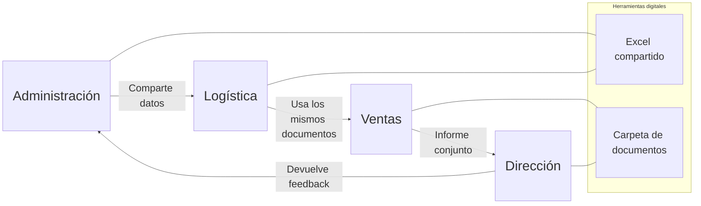

# ORG-DIG-02 – Reorganización de departamentos con soporte digital  

La tarea ORG-DIG-02 busca **relacionar la implantación de tecnología digital con la organización interna de la empresa**.  

En el caso de **CanaryBanana**, esto significa:  

- Pasar de procesos aislados (cada departamento trabaja por separado) a **procesos integrados** donde todos comparten la misma información.  
- Reducir duplicidad de tareas (ej. administración y logística repiten datos).  
- Mejorar la comunicación entre **administración, logística, ventas y dirección**.  
- Medir el impacto en **eficiencia administrativa, reducción de errores y ahorro de tiempo**.  

El resultado debe ser una propuesta clara de cómo la digitalización (uso de Excel compartido, plantillas, conectividad, etc.) ayuda a reorganizar la empresa.

---

## Instrucciones ORG-DIG-02 en la Excel

1. Selecciona en cada proyecto si se implementa (SI/NO).
2. Asigna un costo (Junior, Medio, Senior) y la tecnología a utilizar (NO UTILIZAR, EXCEL, EXCEL+CONECTIVIDAD, WEB FORMACIÓN).  
3. Marca la rentabilidad esperada (Baja, Media, Alta) para cada proyecto.  
4. Selecciona que métrica a utilizar por proyecto.
5. Selecciona si los proyectos afectan al clima laboral en las diferentes categorías. Si consideras que no afecta escoge (SIN SELECCIONAR)

## Proyectos

### 1. Sistema de información con Excel

Crear un libro Excel compartido entre administración, logística y ventas, donde todos registren pedidos, inventario y facturación en tiempo real.  

### 2. Asignación de responsables

Definir responsables digitales en cada departamento para coordinar el uso de herramientas y asegurar que los datos estén actualizados.  

### 3. Formación personal

Capacitar al equipo en el uso de herramientas digitales básicas (Excel avanzado, uso de carpetas compartidas).  

## Costos

Los costos en el proceso de digitalización se vinculan al perfil de consultor requerido.  

- **Consultor Junior**: tareas básicas de soporte y formación inicial.  
- **Consultor Medio**: coordinación de procesos, formación avanzada y acompañamiento.  
- **Consultor Senior**: diseño de la arquitectura digital y liderazgo de proyectos estratégicos.  

Cada proyecto debe asignar un perfil de consultor según su complejidad, lo que determina si el coste es **bajo, medio o alto**.  

---

## Rentabilidad esperada

La digitalización puede generar distintos niveles de retorno:

- **Alta rentabilidad** → proyectos que reducen de forma significativa los tiempos o aumentan mucho la eficiencia (ejemplo: integración de datos entre departamentos).  
- **Media rentabilidad** → proyectos que mejoran la calidad de la información y facilitan el trabajo, pero con impacto gradual.  
- **Baja rentabilidad** → proyectos de apoyo o complementarios (ejemplo: formación puntual), que aportan valor pero no transforman de inmediato los resultados.  

---

## Métricas

### Reducción de tiempo

Hace referencia a cómo la digitalización puede impactar en la **velocidad de los procesos administrativos y logísticos**.  
Un consultor de nivel medio implica que la tarea requiere conocimientos prácticos y coordinación, pero no un rediseño estratégico profundo.  
El retorno esperado es **medio**, porque aunque el ahorro de tiempo es relevante, no supone todavía una transformación total de la organización.  

### Incrementar calidad

Está relacionado con la **fiabilidad de la información y los documentos generados por la empresa**.  
Al asignar un consultor junior, se sugiere que se trata de tareas de apoyo y control básico de la calidad de datos.  
La rentabilidad es **baja**, ya que las mejoras en calidad son positivas, pero su efecto directo sobre los resultados de negocio es limitado en el corto plazo.  

### Evitar errores

Se refiere al **objetivo de disminuir fallos en los procesos internos**, especialmente en la preparación de documentos de exportación y en la comunicación entre departamentos.  
El hecho de que todavía no se haya asignado un consultor refleja que es un aspecto crítico, pero que requiere decidir qué perfil es el más adecuado para abordarlo.  

Para evaluar el impacto de los proyectos, se utilizan métricas cualitativas con tres niveles de logro:  

- **Alta** → resultados claramente visibles en eficiencia, reducción de errores o ahorro de tiempo.  
- **Media** → mejoras parciales, que apoyan al conjunto pero no transforman por sí solas.  
- **Baja** → cambios más limitados, cuyo efecto se nota a largo plazo o en áreas puntuales.  

## Clima laboral

### Opciones de clima laboral positivo

1. **Colaboración interdepartamental**  
   - Los equipos de administración, logística y ventas comparten la misma información en Excel conectado.  
   - Esto reduce tensiones y genera sensación de “trabajar juntos”.  

2. **Reconocimiento del esfuerzo digital**  
   - La empresa invierte en formación digital (proyecto de *Formación personal*).  
   - Los empleados se sienten valorados y actualizados, lo que aumenta su motivación.  

3. **Mejora de la autonomía**  
   - Con responsables claros de cada proyecto (proyecto de *Asignación de responsables*), los trabajadores tienen más control sobre su área.  
   - Esto genera confianza y satisfacción.  

### Opciones de clima laboral negativo

1. **Resistencia al cambio**  
   - Algunos empleados pueden sentirse inseguros al pasar de métodos manuales a herramientas digitales.  
   - Riesgo de percepción de que “lo nuevo complica más que ayuda”.  

2. **Sobrecarga inicial de trabajo**  
   - Durante la implantación del sistema (proyecto *Sistema de información con Excel*), puede haber picos de carga extra por adaptación y migración de datos.  

3. **Brecha digital interna**  
   - No todos los trabajadores tienen el mismo nivel de conocimientos digitales.  
   - Riesgo de desigualdades y frustración si no se acompaña con suficiente formación.  
