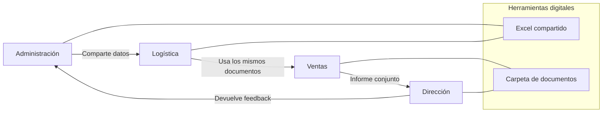

# Reorganización de departamentos con soporte digital  

**Criterio:** Relaciona la implantación de la tecnología digital con la organización de las empresas  
**Nombre interno:** ORG-DIG-02  

## Punto de partida (CanaryBanana)

- La empresa usa ofimática y programas básicos, pero no están conectados entre sí.  
- Cada departamento trabaja por separado y se repiten tareas.  
- Ejemplo: en administración se preparan documentos que logística vuelve a introducir a mano.  

## Objetivo

Mostrar cómo la organización mejora cuando se usa tecnología digital:

- Todos los departamentos trabajan con la misma información actualizada.  
- Se reducen errores y duplicidad de tareas.  
- Mejor comunicación entre administración, logística y ventas.  

## Propuesta práctica  

- Crear plantillas digitales compartidas (ejemplo: Excel de clientes y pedidos).  
- **[TAREA] ¿Que otras propuestas realizarías?**

## Coste (Calculadora de horas de trabajo)

- **[TAREA] Definir cuantas horas (tabla horas)**
- **[TAREA] Definir el perfil (tabla)**

## Rentabilidad esperada

- Ahorro de tiempo en administración. **[TAREA]Cuantificar.** 
- Menos errores en documentos de exportación.  **[TAREA]Cuantificar**
- **[TAREA] Añade una nueva rentabilidad y trata de cuantificarla**  

## Clima laboral

- **[TAREA]** Define un máximo de 2 resistencias puedes encontrar.
- **[TAREA]** Define un máximo de 2 argumentos para rebatirlas.

## Métricas de éxito

- **[TAREA] Propón indicadores que sirva para medir la eficiencia administrativa.**  

---
