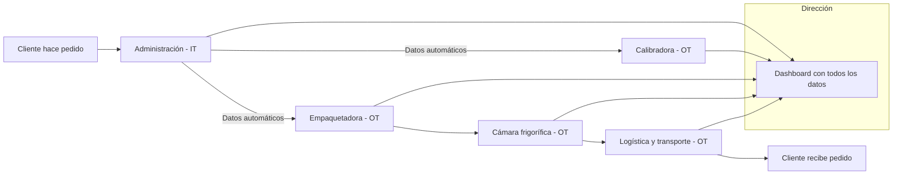

# DIG-E2E-07 – Digitalización de extremo a extremo (IT+OT)  

La tarea DIG-E2E-07 busca **integrar los procesos de oficina (IT) con los de planta y logística (OT)** en la empresa.  

En el caso de **CanaryBanana**, esto significa:  

- Pasar de sistemas desconectados (IT y OT por separado) a un **flujo digital único**.  
- Eliminar la duplicidad de datos entre pedidos, planta y logística.  
- Mejorar la trazabilidad de pedidos desde la entrada hasta la entrega.  
- Medir el impacto en **errores, retrasos y costes energéticos**.  

El resultado debe ser una propuesta clara de cómo la digitalización extremo a extremo ayuda a reorganizar y optimizar la empresa.  

---

## Instrucciones DIG-E2E-07 en la Excel

1. Selecciona en cada proyecto si se implementa (SI/NO).  
2. Asigna un costo (Junior, Medio, Senior) y la tecnología a utilizar.  
3. Marca la rentabilidad esperada (Baja, Media, Alta) para cada proyecto.  
4. Selecciona la métrica a utilizar por proyecto.  
5. Selecciona si los proyectos afectan al clima laboral en las diferentes categorías. Si consideras que no afecta escoge (SIN SELECCIONAR).  

---

## Proyectos

### 1. Integración IT–OT de pedidos y planta  
Conectar los pedidos de clientes (IT) con calibradoras y empaquetadoras (OT) para que los datos fluyan automáticamente sin repetición manual.  

### 2. Monitorización digital de frío y transporte  
Instalar sensores IoT en cámaras frigoríficas y transporte para registrar temperatura, consumo energético y alertas en tiempo real.  

### 3. Panel único para dirección y clientes  
Crear un dashboard que unifique pedidos, estado de planta, sensores y logística, accesible tanto por la dirección como para ofrecer transparencia a los clientes.  

---

## Costos

Los costos en el proceso de digitalización extremo a extremo se vinculan al perfil de consultor y a la infraestructura OT:  

- **Consultor Junior:** tareas básicas de soporte y formación inicial (35–50 €/h).  
- **Consultor Medio:** coordinación de procesos y formación avanzada (55–80 €/h).  
- **Consultor Senior:** diseño de la arquitectura digital y liderazgo estratégico (95–120 €/h).  

Además, se contemplan **costes de hardware OT**:  

- 3 PLCs industriales → 7.500 €  
- 20 Sensores IoT → 10.000 €  
- 5 Cámaras IP → 4.000 €  
- 2 Gateways IT–OT → 4.000 €  

**Total estimado hardware OT: 25.500 €**  

Cada proyecto debe asignar un perfil de consultor y los equipos OT necesarios, lo que determina si el coste es bajo, medio o alto.  

---

## Rentabilidad esperada

La digitalización extremo a extremo puede generar distintos niveles de retorno:  

- **Alta rentabilidad** → proyectos que eliminan errores, reducen retrasos y optimizan energía (ejemplo: integración pedidos–planta).  
- **Media rentabilidad** → proyectos que facilitan la monitorización y mejoran la calidad de la información (ejemplo: sensores de frío).  
- **Baja rentabilidad** → proyectos de apoyo que mejoran visibilidad pero con impacto gradual (ejemplo: dashboard de clientes).  

---

## Métricas de éxito

- Reducción de retrasos en exportaciones.  
- Reducción de costes energéticos en cámaras.
- Aumento de satisfacción y confianza de clientes.  

---

## Clima laboral

**Clima laboral positivo**

1. Menos tareas repetitivas → disminuye la carga manual en administración y logística.

2. Mejor comunicación interdepartamental → todos trabajan con la misma información en tiempo real.

3. Facilidad en el día a día → paneles y alertas que simplifican la gestión y reducen errores.

**Clima laboral negativo**

1. Resistencia al cambio → parte del personal puede sentirse incómodo con nuevas herramientas.

2. Necesidad de formación intensiva → la curva de aprendizaje en IT–OT genera presión inicial.

3. Sobrecarga en la transición → mientras conviven sistemas antiguos y digitales, aumenta la carga temporal.