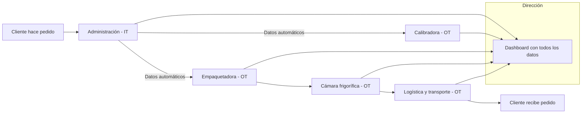

# Ventajas de digitalizar de extremo a extremo en CanaryBanana  

**Criterio 7:** Analiza los beneficios de digitalizar una empresa industrial de extremo a extremo  

**Nombre interno:** DIG-E2E-07  

## Punto de partida (CanaryBanana)

- **IT (oficina):** pedidos en Excel, facturas básicas, correo electrónico.  
- **OT (planta y logística):** cintas, calibradoras, empaquetadoras, cámaras frigoríficas, sensores de transporte.  

👉 Hoy IT y OT funcionan por separado.  

## Objetivo

Explicar qué pasa si se digitaliza todo el proceso:

- **[TAREA] ¿Que objetivos cumpliras?**

## Propuesta práctica  

Identifica en el gráfico los procesos

1. Pedido digital del cliente → entra en IT.  
2. ¿?
3. ¿?
4. ¿ggggg?
5. ¿ffff?

## Coste 

Lista de los costes de digitalizar los procesos

1 Proceso : 10.000 €
2 Procesos: 12.000 €
3 Procesos: 18.000 €
4 Procesos: 20.000 €
5 Procesos: 25.000 €

## Rentabilidad esperada  

- **[TAREA] Busca un caso real de una empresa agroexportadora que haya digitalizado su cadena. Resume qué beneficios consiguió.**  

## Tecnologías usadas  

- **[TAREA] Busca un caso real de una empresa agroexportadora que haya digitalizado su cadena. Indica que tecnologías utilizó.**  

## Métricas de éxito

- **[TAREA] Errores que podríamos solucionar**
- **[TAREA] Que retrasos podríamos disminuir**
- **[TAREA] Propón una métrica que mida la satisfacción del cliente.**  
