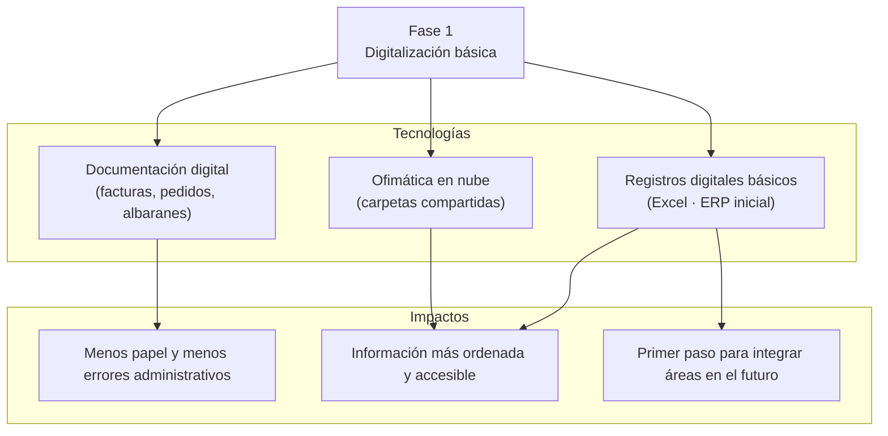
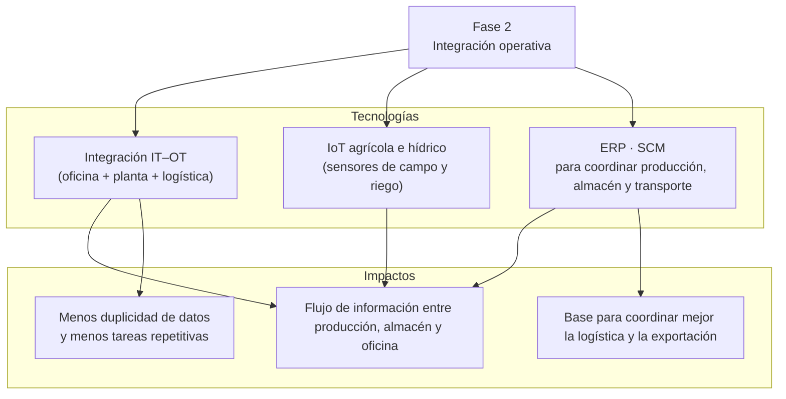
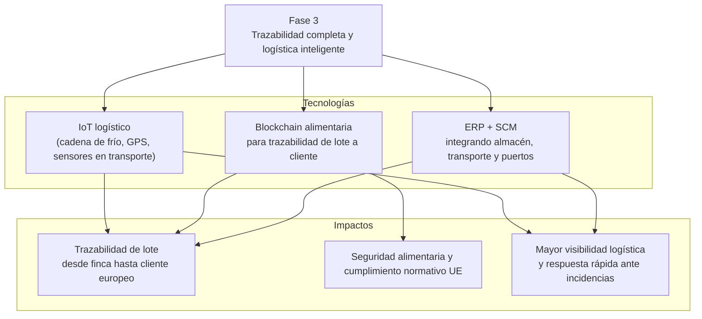
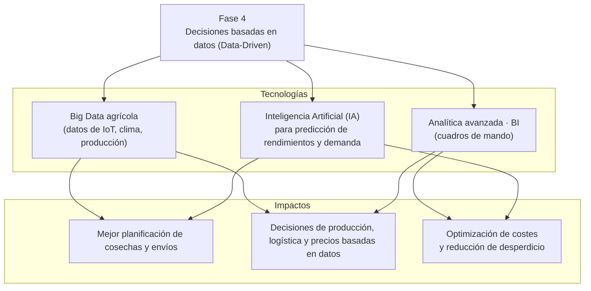
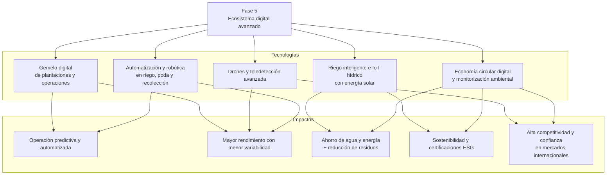

# Roadmap de Implantación de Tecnologías Habilitadoras Digitales (TDH)

La revisión sistemática de las Tecnologías Habilitadoras Digitales (TDH) aplicables a la cadena agro-bananera y al proceso de internacionalización de CanaryBanana ha permitido establecer un marco analítico que justifica la necesidad de ordenar su implantación en un roadmap estructurado por fases.

Esta organización secuencial responde a tres principios fundamentales de los modelos contemporáneos de transformación digital: progresividad, dependencia tecnológica y madurez organizativa.

En primer lugar, el análisis evidencia que las TDH no presentan un impacto homogéneo ni simultáneo. Tecnologías avanzadas como blockchain, inteligencia artificial, sistemas predictivos o gemelos digitales dependen de la existencia previa de infraestructuras de datos consistentes, procesos digitalizados y mecanismos estables de captura de información. La literatura actual en digitalización agroalimentaria confirma que la adopción temprana de tecnologías avanzadas sin una base digital sólida conduce a fallos de uso, baja calidad de datos y pérdida de inversión.

En segundo lugar, el estudio permite discriminar qué tecnologías deben aplicarse en cada etapa del proceso productivo y comercial. Esto implica mapear cada TDH con:

a) el resultado operativo que genera,
b) el impacto estratégico que produce,
c) y el momento óptimo de implantación dentro de la evolución digital de la empresa.

Finalmente, se establece que toda hoja de ruta debe estar acompañada de indicadores verificables (Key Performance Indicators, KPI) que permitan medir el avance, validar el impacto y garantizar que cada fase cumple los requisitos necesarios para habilitar la siguiente.

Con base en estos principios, se ha elaborado un Roadmap de Transformación Digital en cinco fases, que progresivamente conduce a CanaryBanana desde la digitalización básica hasta un ecosistema digital predictivo, automatizado y plenamente trazable.

# Fases de aplicación de TDH

Fase 1 — Digitalización básica

Objetivo

Eliminar el papel y centralizar la información mínima necesaria para poder integrar procesos en el futuro.

Indicadores de medición:

% de documentos gestionados en digital

Nº de errores administrativos reducidos

Nivel de orden y accesibilidad documental

Tiempo medio de búsqueda de información

## Fase 2 — Integración operativa

**Objetivo:** Conseguir interoperabilidad entre producción, logística, almacén y oficina mediante integración IT–OT y sistemas coordinados.

Indicadores de medición:

- Número de sistemas integrados

- Continuidad del flujo de datos entre áreas

- Disminución de tareas manuales repetitivas

- Mejora en la coordinación logística

## Fase 3 — Trazabilidad completa y logística inteligente

**Objetivo**: Garantizar la visibilidad total de lote y cadena logística mediante IoT, blockchain y sistemas SCM.

**Indicadores de medición:**
- Porcentaje de lotes trazados digitalmente

- Nivel de visibilidad logística en tiempo real

- Tiempos de respuesta ante incidencias

- Evidencias generadas para cumplimiento normativo UE

## Fase 4 — Decisiones basadas en datos (Data-Driven)

**Objetivo:** Transformar datos operativos en información predictiva que permita anticipar producción, demandas y comportamientos logísticos.

**Indicadores de medición:**
- Precisión de predicciones (cosecha, demanda, logística)

- Calidad de datos en el Data Lake

- Uso efectivo de dashboards en toma de decisiones

- Ahorro derivado de optimización productiva

## Fase 5 — Ecosistema digital avanzado

**Objetivo:** Construir un sistema agroexportador automatizado, sostenible y anticipativo, con certificaciones ESG y capacidad de respuesta en tiempo real.

**Indicadores de medición:**

- Ahorro hídrico y energético

- Grado de automatización de procesos críticos

- Certificaciones ESG obtenidas

- Mejora de la competitividad internacional

