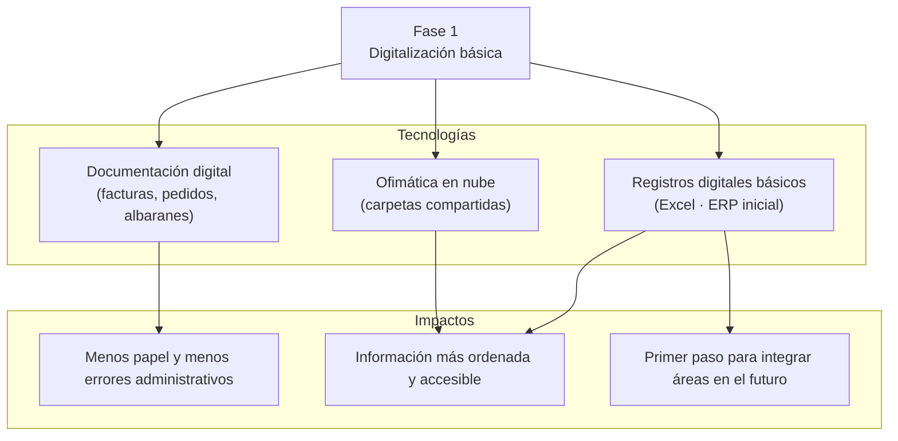
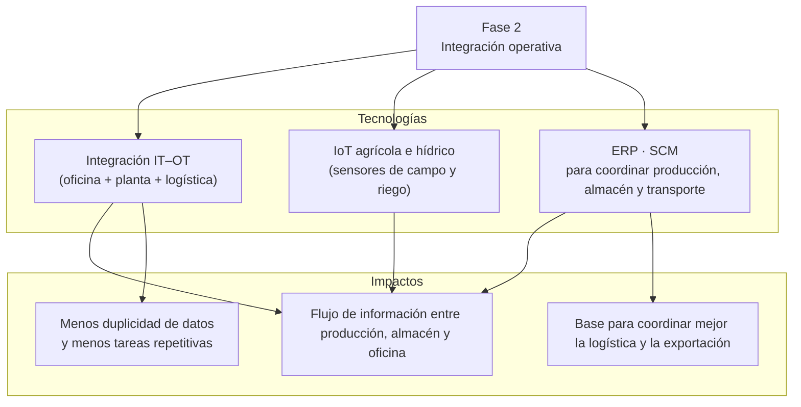
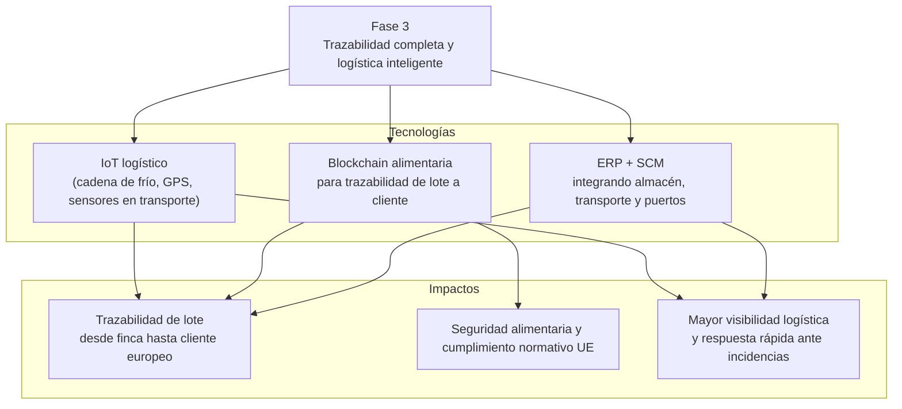
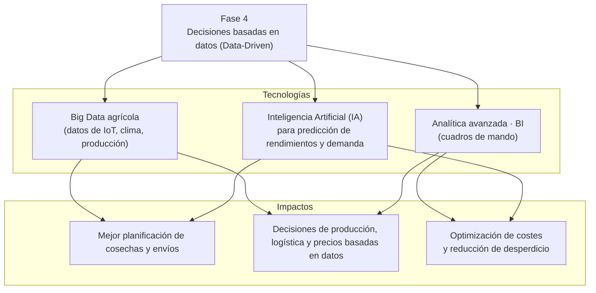
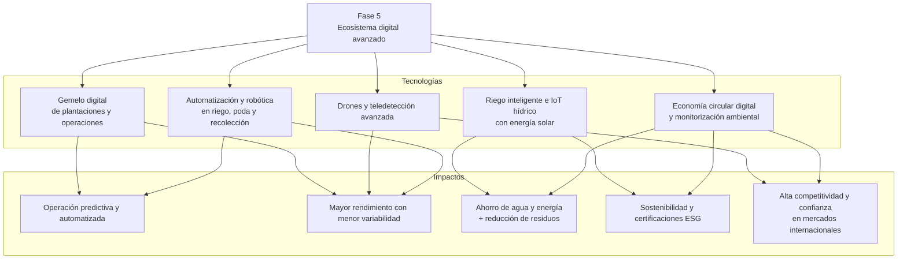

# Fases de aplicación de TDH

```mermaid
flowchart TB
    F1["Fase 1<br>Digitalización básica"]

 subgraph TECNOL["Tecnologías"]
    T1_1["Documentación digital<br>(facturas, pedidos, albaranes)"]
    T1_2["Ofimática en nube<br>(carpetas compartidas)"]
    T1_3["Registros digitales básicos<br>(Excel · ERP inicial)"]
 end

 subgraph IMPACTOS["Impactos"]
    I1_1["Menos papel y menos errores administrativos"]
    I1_2["Información más ordenada y accesible"]
    I1_3["Primer paso para integrar áreas en el futuro"]
 end

 F1 --> T1_1
 F1 --> T1_2
 F1 --> T1_3

 T1_1 --> I1_1
 T1_2 --> I1_2
 T1_3 --> I1_2
 T1_3 --> I1_3


```

```mermaid

flowchart TB
    F2["Fase 2<br>Integración operativa"]

 subgraph TECNOL["Tecnologías"]
    T2_1["Integración IT–OT<br>(oficina + planta + logística)"]
    T2_2["IoT agrícola e hídrico<br>(sensores de campo y riego)"]
    T2_3["ERP · SCM<br>para coordinar producción, almacén y transporte"]
 end

 subgraph IMPACTOS["Impactos"]
    I2_1["Flujo de información entre producción, almacén y oficina"]
    I2_2["Menos duplicidad de datos<br>y menos tareas repetitivas"]
    I2_3["Base para coordinar mejor la logística y la exportación"]
 end

 F2 --> T2_1
 F2 --> T2_2
 F2 --> T2_3

 T2_1 --> I2_1
 T2_1 --> I2_2
 T2_2 --> I2_1
 T2_3 --> I2_1
 T2_3 --> I2_3
```

```mermaid

flowchart TB
    F3["Fase 3<br>Trazabilidad completa y logística inteligente"]

 subgraph TECNOL["Tecnologías"]
    T3_1["IoT logístico<br>(cadena de frío, GPS, sensores en transporte)"]
    T3_2["Blockchain alimentaria<br>para trazabilidad de lote a cliente"]
    T3_3["ERP + SCM<br>integrando almacén, transporte y puertos"]
 end

 subgraph IMPACTOS["Impactos"]
    I3_1["Trazabilidad de lote<br>desde finca hasta cliente europeo"]
    I3_2["Seguridad alimentaria y cumplimiento normativo UE"]
    I3_3["Mayor visibilidad logística<br>y respuesta rápida ante incidencias"]
 end

 F3 --> T3_1
 F3 --> T3_2
 F3 --> T3_3

 T3_1 --> I3_1
 T3_1 --> I3_3
 T3_2 --> I3_1
 T3_2 --> I3_2
 T3_3 --> I3_1
 T3_3 --> I3_3

```

```mermaid
flowchart TB
    F4["Fase 4<br>Decisiones basadas en datos (Data-Driven)"]
 

 subgraph TECNOL["Tecnologías"]
    T4_1["Big Data agrícola<br>(datos de IoT, clima, producción)"]
    T4_2["Analítica avanzada · BI<br>(cuadros de mando)"]
    T4_3["Inteligencia Artificial (IA)<br>para predicción de rendimientos y demanda"]
 end

 subgraph IMPACTOS["Impactos"]
    I4_1["Mejor planificación de cosechas y envíos"]
    I4_2["Decisiones de producción, logística y precios basadas en datos"]
    I4_3["Optimización de costes<br>y reducción de desperdicio"]

 end

 F4 --> T4_1
 F4 --> T4_2
 F4 --> T4_3

 T4_1 --> I4_1
 T4_1 --> I4_2
 T4_2 --> I4_2
 T4_2 --> I4_3
 T4_3 --> I4_1
 T4_3 --> I4_3
```

```mermaid
flowchart TB
    F5["Fase 5<br>Ecosistema digital avanzado"]

 subgraph TECNOL["Tecnologías"]
    T5_1["Gemelo digital<br>de plantaciones y operaciones"]
    T5_2["Drones y teledetección avanzada"]
    T5_3["Riego inteligente e IoT hídrico<br>con energía solar"]
    T5_4["Automatización y robótica<br>en riego, poda y recolección"]
    T5_5["Economía circular digital<br>y monitorización ambiental"]

 end

 subgraph IMPACTOS["Impactos"]
    I5_1["Operación predictiva y automatizada"]
    I5_2["Mayor rendimiento con menor variabilidad"]
    I5_3["Ahorro de agua y energía<br>+ reducción de residuos"]
    I5_4["Sostenibilidad y certificaciones ESG"]
    I5_5["Alta competitividad y confianza<br>en mercados internacionales"]
 end

 F5 --> T5_1
 F5 --> T5_2
 F5 --> T5_3
 F5 --> T5_4
 F5 --> T5_5

 T5_1 --> I5_1
 T5_1 --> I5_2
 T5_2 --> I5_2
 T5_2 --> I5_5
 T5_3 --> I5_3
 T5_3 --> I5_4
 T5_4 --> I5_1
 T5_4 --> I5_2
 T5_5 --> I5_3
 T5_5 --> I5_4
 T5_5 --> I5_5

```