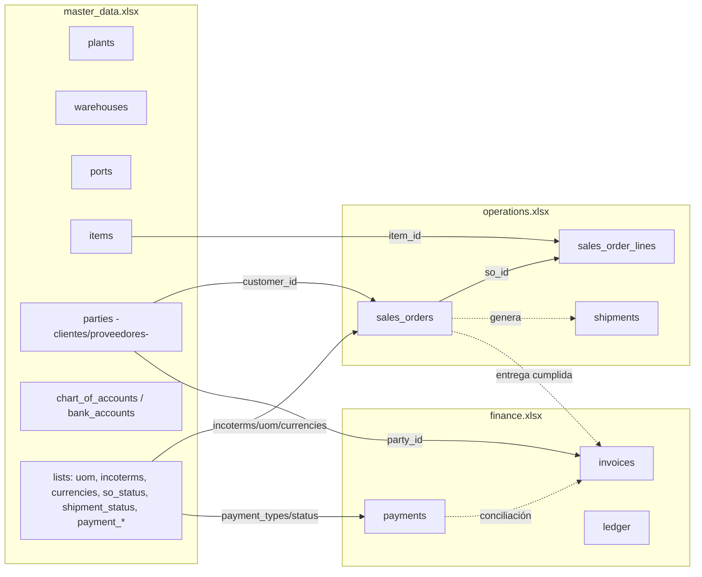
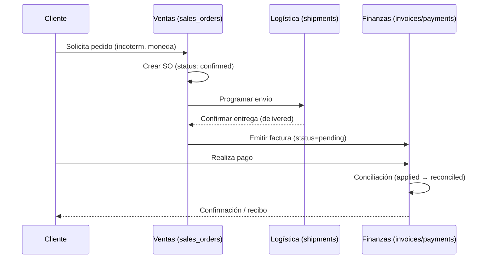

# Estructura de los ficheros Excel

- **`master_data.xlsx`** → Datos maestros: plantas, almacenes, clientes, puertos, artículos y cuentas.  
- **`operations.xlsx`** → Operaciones comerciales: pedidos de venta, líneas, envíos.  
- **`finance.xlsx`** → Finanzas: facturas, pagos, conciliación.

---

## Mapa del sistema

El guiente diagrama muestra cómo los tres Excel se conectan:

**Explicación**:  
- El **Master Data** centraliza las entidades (clientes, artículos, puertos).  
- **Operaciones** gestiona pedidos y logística.  
- **Finanzas** refleja facturación y cobros.  
- Todo se une mediante claves (`customer_id`, `so_id`, `party_id`).

---

## Flujo “Order-to-Cash”
Este diagrama describe el ciclo completo de negocio:

---

## Ejemplo real

- Cliente **PT-003 (Berlin3)** hace un pedido **SO-0043**.  
- Se confirma el pedido y se programa el envío.  
- Se emite factura **INV-0043** por **944,4 €**.  
- El ciclo conecta `master_data.xlsx` → `operations.xlsx` → `finance.xlsx`.

---

## Beneficios de la digitalización

- Elimina duplicidades y errores manuales.  
- Integra logística, ventas y finanzas en un solo flujo.  
- Mejora la transparencia hacia clientes internacionales.  
- Permite análisis económico y estratégico a partir de datos fiables.  