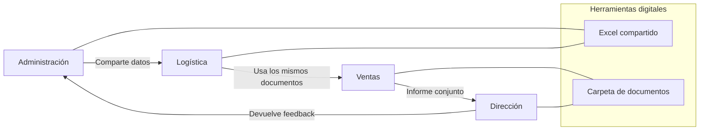
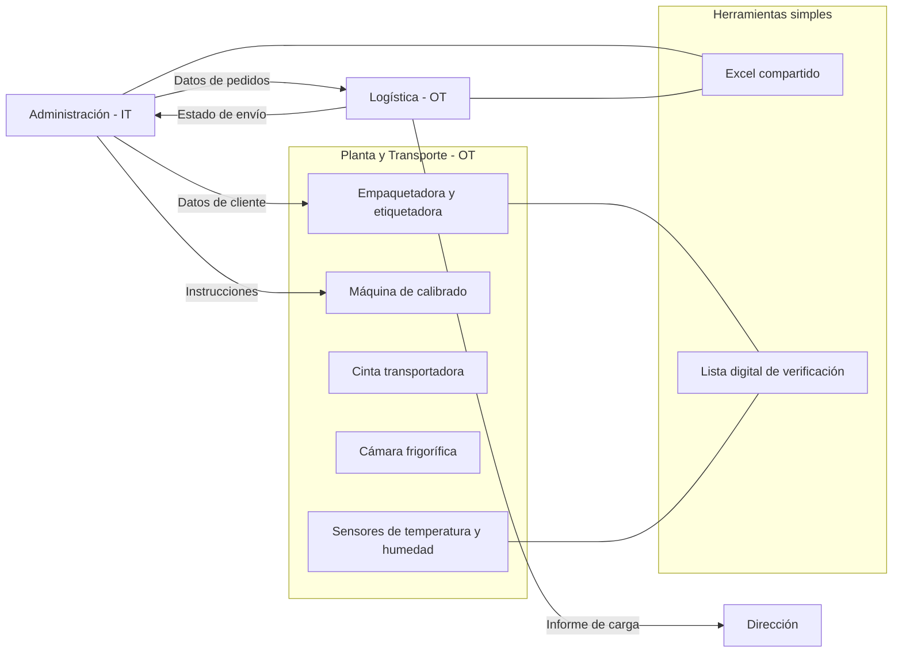
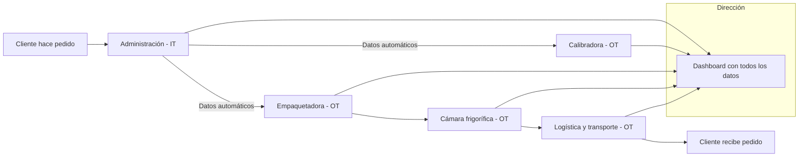

# Reorganización de departamentos con soporte digital

**Criterio 2:** Relaciona la implantación de la tecnología digital con la organización de las empresas  
**Nombre interno:** ORG-DIG-02  

## Punto de partida (CanaryBanana)

- La empresa usa ofimática y programas básicos, pero no están conectados entre sí.  
- Cada departamento trabaja por separado y se repiten tareas.  
- Ejemplo: en administración se preparan documentos que logística vuelve a introducir a mano.  

## Objetivo  

Mostrar cómo la organización mejora cuando se usa tecnología digital:  

- Todos los departamentos trabajan con la misma información actualizada.  
- Se reducen errores y duplicidad de tareas.  
- Mejor comunicación entre administración, logística y ventas.  

## Propuesta práctica  

1. Identificar procesos repetidos (ejemplo: facturas duplicadas).  
2. Crear plantillas digitales compartidas (ejemplo: Excel de clientes y pedidos).  
3. Asignar responsables claros de cada proceso.  
4. Formar a los empleados en esas herramientas.  

## Coste (rango)  
- Base: 15.000 €  
- Mín–Máx: 10.000 – 20.000 €  

## Rentabilidad esperada  
- Ahorro de tiempo en administración (~40.000 €/año).  
- Menos errores en documentos de exportación.  
- Mejor coordinación → más confianza de clientes.  

## Clima laboral  
- Al principio: resistencia (“esto siempre lo hicimos así”).  
- Después: positivo, porque el trabajo diario es más sencillo y organizado.  

## Departamentos implicados
- Administración  
- Logística y aduanas  
- Comercio internacional / Ventas  
- Dirección  

## Tecnologías usadas  
- Excel con plantillas comunes  
- Carpetas digitales organizadas  
- Herramientas básicas de comunicación interna  

## Métricas de éxito  
- Procesos repetidos eliminados (>70%).  
- Reducción de errores en documentos (-50%).  
- Tiempo ahorrado en la preparación de pedidos.  

## Diagrama (Mermaid)  

## Explicación sencilla  
La tecnología digital no es solo ordenadores o programas nuevos.  
Es una forma de organizar mejor el trabajo.  
En CanaryBanana, si los departamentos usan las mismas herramientas digitales (plantillas y carpetas compartidas), evitan repetir trabajo y se entienden mejor.  

---

# 📘 Ficha 6 — Conexión entre IT y OT en CanaryBanana  
**Criterio 6:** Analiza la importancia de la conexión entre entornos IT y OT  
**Nombre interno:** CON-ITOT-06  

## Punto de partida (CanaryBanana)  
- **IT:** ordenadores, programas de oficina, contabilidad y gestión de clientes.  
- **OT:** maquinaria y procesos productivos:  
  - cintas transportadoras,  
  - máquinas de calibrado y clasificación,  
  - empaquetadoras y etiquetadoras,  
  - cámaras frigoríficas,  
  - sensores de temperatura y humedad.  

👉 Actualmente IT y OT no están conectados.  
Ejemplo: la oficina prepara un pedido en Excel (IT), y el operario debe volver a introducir los datos en la empaquetadora (OT).  

## Objetivo  
Conseguir que los sistemas de oficina (IT) hablen directamente con las máquinas de planta (OT).  
- Los pedidos de administración llegan a la empaquetadora sin reescribirlos.  
- Los sensores de temperatura envían datos a la oficina.  
- Reducir errores y ahorrar tiempo.  

## Propuesta práctica  
1. Detectar puntos de desconexión (documentos que se reescriben en máquinas).  
2. Crear flujos básicos de datos (ejemplo: Excel conectado con la empaquetadora).  
3. Formar a los equipos IT y OT.  
4. Usar listas digitales de verificación.  

## Coste (rango)  
- Base: 15.000 €  
- Mín–Máx: 10.000 – 20.000 €  

## Rentabilidad esperada  
- Ahorro de 35.000 €/año en tiempo y errores.  
- Reducción de fallos en calibradoras y empaquetadoras.  
- Menos retrasos en exportaciones.  

## Clima laboral  
- Positivo: menos tareas repetitivas para operarios y administrativos.  
- Mejor comunicación entre oficina y planta.  

## Departamentos implicados  
- Administración (IT)  
- Logística (OT)  
- Producción y empaquetado (OT)  
- Dirección  

## Tecnologías usadas  
- Excel compartido  
- Tablas de control digital  
- Interfaces simples con maquinaria  

## Métricas de éxito  
- Reprogramaciones manuales de máquinas reducidas -70%.  
- Errores en etiquetas reducidos -50%.  
- Incidencias en envíos reducidas -20%.  

## Diagrama (Mermaid)  

## Explicación sencilla  
En CanaryBanana, IT es la oficina (pedidos, facturas).  
OT son las máquinas (cintas, calibradoras, empaquetadoras, cámaras).  

El problema: trabajan por separado.  
Si se conectan, los pedidos de Excel llegan a las máquinas automáticamente, los sensores informan a la oficina y todo fluye sin errores.  

---

# 📘 Ficha 7 — Ventajas de digitalizar de extremo a extremo en CanaryBanana  
**Criterio 7:** Analiza los beneficios de digitalizar una empresa industrial de extremo a extremo  
**Nombre interno:** DIG-E2E-07  

## Punto de partida (CanaryBanana)  
- **IT (oficina):** pedidos en Excel, facturas básicas, correo electrónico.  
- **OT (planta y logística):** cintas, calibradoras, empaquetadoras, cámaras frigoríficas, sensores de transporte.  

👉 Hoy IT y OT funcionan por separado.  

## Objetivo  
Explicar qué pasa si se digitaliza todo el proceso:  
- El pedido del cliente fluye hasta la planta y logística sin interrupciones.  
- Conexión de todos los sistemas en un único flujo continuo.  
- Reducir errores, ahorrar costes y ser más competitivos.  

## Propuesta práctica  
1. Pedido digital del cliente → entra en IT.  
2. Conexión con planta → calibradora y empaquetadora reciben datos.  
3. Cámaras frigoríficas → sensores registran temperatura y alertan.  
4. Logística → seguimiento en oficina y para el cliente.  
5. Dirección → ve todo en un panel único.  

## Coste (rango)  
- Base: 20.000 €  
- Mín–Máx: 15.000 – 25.000 €  

## Rentabilidad esperada  
- Ahorro de 200.000 €/año: menos errores, menos retrasos, mejor energía en cámaras.  
- Mejora de confianza de clientes → posibilidad de más ventas.  

## Clima laboral  
- Positivo: tareas conectadas, menos repeticiones.  
- Requiere formación pero facilita el día a día.  

## Departamentos implicados  
- Administración (IT)  
- Logística y aduanas (OT)  
- Producción y empaquetado (OT)  
- Dirección  

## Tecnologías usadas  
- Excel integrado en flujo digital  
- Tablas de control digital en planta  
- Sensores de frío  
- Paneles de seguimiento  

## Métricas de éxito  
- Errores en pedidos y etiquetas reducidos -70%.  
- Retrasos en exportaciones reducidos -50%.  
- Costes energéticos en cámaras reducidos -15%.  
- Clientes más satisfechos.  

## Diagrama (Mermaid)  

## Explicación sencilla  
Hoy, cada área trabaja por separado.  
Si todo se digitaliza:  
- El pedido entra en IT y llega solo a planta.  
- Las máquinas saben qué hacer sin repetir datos.  
- Los sensores avisan de problemas en frío.  
- La logística y la oficina comparten la misma información.  
- Dirección lo ve todo en un panel.  

La empresa funciona como un sistema único: rápido, con menos errores y más confianza para los clientes.
