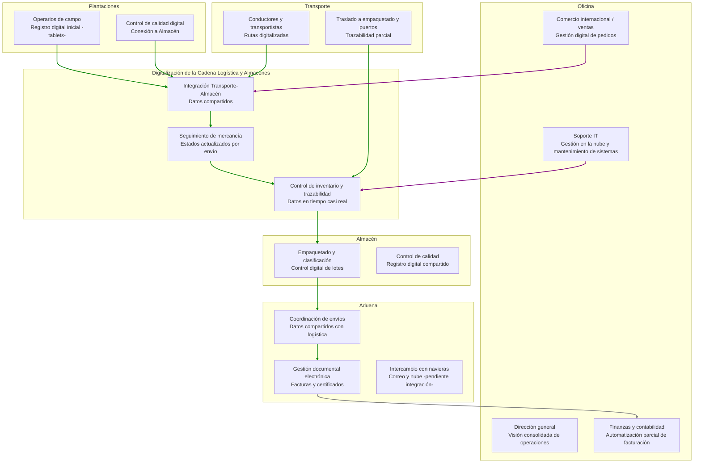

# Impacto Digital Proyectos

## Resumen Ejecutivo

Los proyectos ORG-DIG-02 y ORG-DIG-07 han marcado el inicio de un proceso de transformación digital en CanaryBanana Export. Aunque la empresa ha conseguido avances significativos en la organización y gestión de su información, la digitalización aún se encuentra en una fase inicial. Se han mejorado aspectos clave como la trazabilidad logística, la integración de datos entre áreas y la automatización parcial de los procesos administrativos. Sin embargo, persisten retos relacionados con la adopción del cambio, la capacitación del personal y la consolidación de una infraestructura tecnológica más madura. Este informe presenta los principales logros y dificultades observadas tras la puesta en marcha de los proyectos.

De los nuevos proyectos se han implementado un repositorio en la nube (**drive compartido**) y  se ha digitalizado la cadena logística y almacenes (**impresión de etiquetas y lectores de información desde la plantación al almacen** ).

## Desarrollo

Antes del despliegue de los proyectos de digitalización, CanaryBanana Export operaba con un nivel tecnológico muy básico.Las tareas administrativas, contables y logísticas se gestionaban de forma manual o mediante hojas de cálculo independientes. Esta fragmentación generaba duplicidades, errores en la documentación y lentitud en la coordinación entre departamentos. La falta de trazabilidad digital dificultaba la respuesta ante incidencias y limitaba la transparencia hacia los clientes internacionales.

Con los proyectos ORG-DIG-02 y ORG-DIG-07 se ha puesto en marcha una estructura inicial de gestión integrada, apoyada en modelos digitales de datos y operaciones. La implantación de un sistema de datos maestros ha permitido ordenar información básica sobre clientes, productos, puertos y plantas, creando una base común para las áreas de logística, finanzas y ventas. Este avance, aunque parcial, ha contribuido a mejorar la coherencia interna de los datos y a reducir los errores derivados de la gestión manual.

Uno de los progresos más visibles se encuentra en el control de las operaciones logísticas. La digitalización de pedidos y envíos ha introducido un sistema de seguimiento más sistemático, con estados que permiten conocer la evolución de cada envío. Aun así, la trazabilidad completa en tiempo real no se ha alcanzado, ya que la integración con los agentes externos y las navieras sigue dependiendo de intercambios manuales o de correos electrónicos. Este punto se identifica como un área prioritaria de mejora en futuras fases del proceso.

En el ámbito financiero, la automatización de las facturas y su vinculación con los pedidos ha permitido reducir parte del trabajo manual del personal administrativo. No obstante, el sistema aún requiere intervenciones frecuentes para la conciliación de pagos y la validación de datos. Los avances en este campo muestran un potencial claro, pero también evidencian la necesidad de consolidar procesos más estables y de dotar al personal de formación en el uso de las nuevas herramientas.

La migración hacia herramientas en la nube ha supuesto una mejora relevante en el acceso a la información, especialmente para el personal que trabaja entre distintas islas o en contacto con puertos internacionales. Sin embargo, la infraestructura de red y la conectividad no siempre garantizan un rendimiento óptimo. Persisten también dudas entre algunos empleados respecto a la seguridad y privacidad de los datos almacenados en entornos compartidos.

A nivel organizativo, los cambios tecnológicos han comenzado a modificar la dinámica interna. Algunos roles administrativos han evolucionado hacia funciones más analíticas, mientras que el área de IT ha adquirido mayor protagonismo como soporte a la gestión. 

No obstante, la adopción del cambio ha sido desigual: mientras parte del personal se adapta con rapidez, otros manifiestan dificultades en el manejo de las nuevas herramientas o cierta resistencia a abandonar los métodos tradicionales.

En conjunto, la digitalización ha permitido a la dirección disponer de una visión más clara de las operaciones, aunque el uso analítico de los datos sigue siendo incipiente. La empresa comienza a incorporar criterios de eficiencia y control basados en información integrada, pero aún debe avanzar hacia sistemas de análisis más automatizados y cuadros de mando operativos.

El impacto positivo de los proyectos es evidente, aunque limitado todavía por la falta de madurez tecnológica y por la necesidad de consolidar la cultura digital entre todos los equipos.

---

## Diagrama actualizado

---
