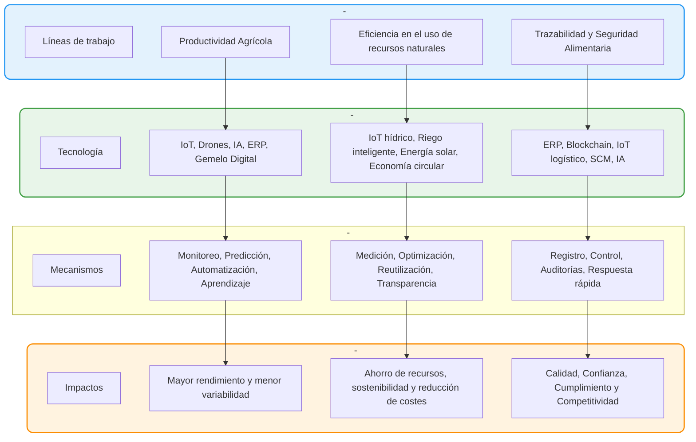
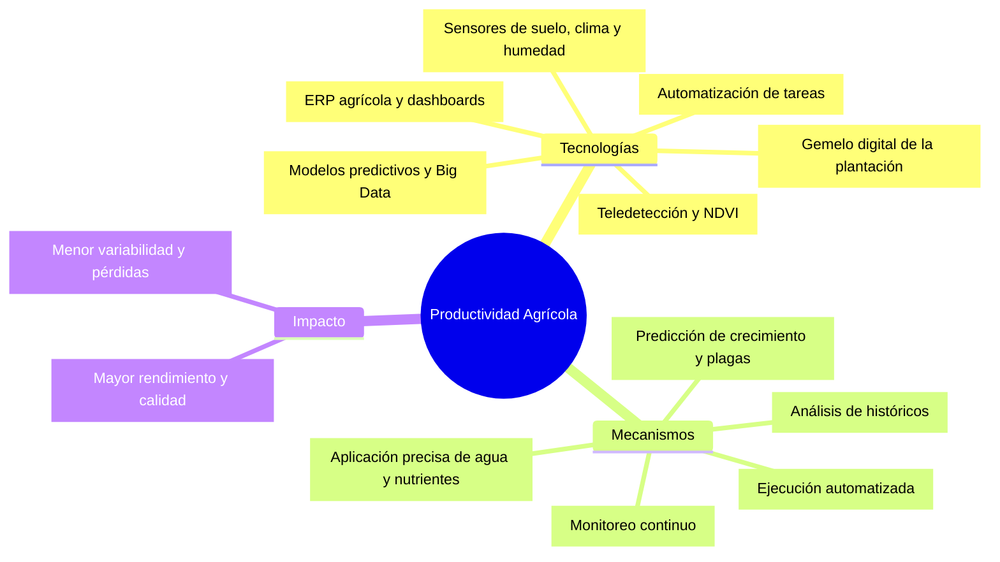
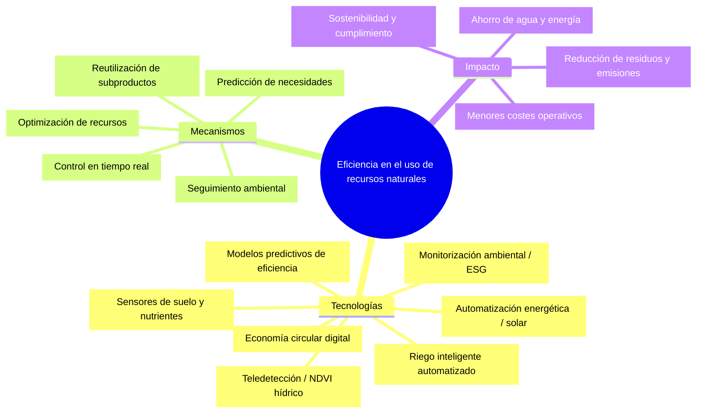
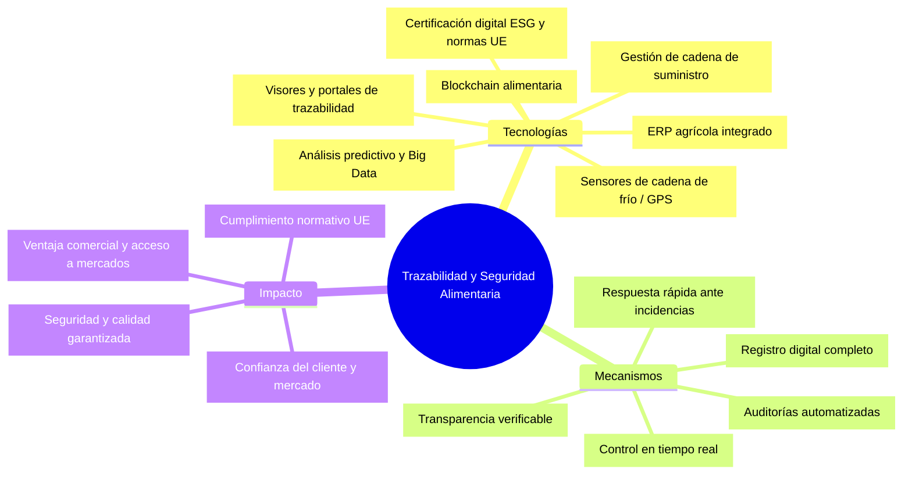

# Transformación Digital Agro-Bananera

## 1. Tecnologías Habilitadoras Digitales

### Ámbito de producción y eficiencia operativa
- **IoT agrícola:** sensores de suelo, humedad, temperatura, nutrientes y radiación.  
- **Teledetección y drones:** imágenes multiespectrales, NDVI, detección de estrés hídrico y plagas.  
- **Gemelo digital:** simulación virtual de plantaciones y escenarios de manejo.  
- **Automatización y robótica:** maquinaria inteligente para riego, poda y recolección.  
- **Riego inteligente:** control automático con datos IoT y predicciones meteorológicas.  
- **Automatización energética:** control del consumo e integración con energías renovables (fotovoltaica).  

### Ámbito de gestión y análisis de datos
- **ERP agrícola:** registro centralizado de costes, lotes, rendimientos y operaciones.  
- **Big Data agrícola:** lago de datos unificado para integrar información de sensores, clima y producción.  
- **Inteligencia Artificial (IA):** predicción de rendimientos, plagas, eficiencia hídrica y logística.  
- **Dashboards y BI:** visualización de indicadores clave (KPIs) de producción, costes, eficiencia y sostenibilidad.  

### Ámbito de trazabilidad, seguridad y sostenibilidad
- **Blockchain alimentaria:** registro inmutable de la cadena productiva y logística.  
- **SCM (Supply Chain Management):** coordinación de proveedores, transporte y distribución.  
- **Certificación digital y ESG:** integración con normas GlobalG.A.P, ISO 22000, Rainforest Alliance.  
- **IoT logístico:** sensores de cadena de frío, GPS, temperatura y humedad en transporte.  
- **Economía circular digital:** plataformas para reutilizar residuos agrícolas (biogás, compost).  
- **Monitorización ambiental:** seguimiento automático de emisiones, agua, energía y residuos.  

---

## 2. Mapa General

## 3. Productividad Agrícola

---

## 4. Eficiencia en el Uso de Recursos Naturales

---

## 5. Trazabilidad y Seguridad Alimentaria

---

## 6. Conclusión

Este documento sintetiza los TDH para agroindustrias a traves de  
tres ejes fundamentales —**Productividad, Eficiencia y Trazabilidad**— su interconexión  mediante datos y tecnologías digitales, generando un **ecosistema agrícola inteligente, sostenible y competitivo**.
