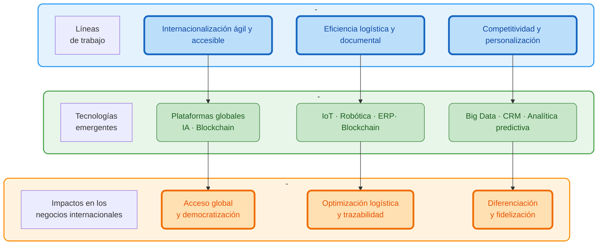
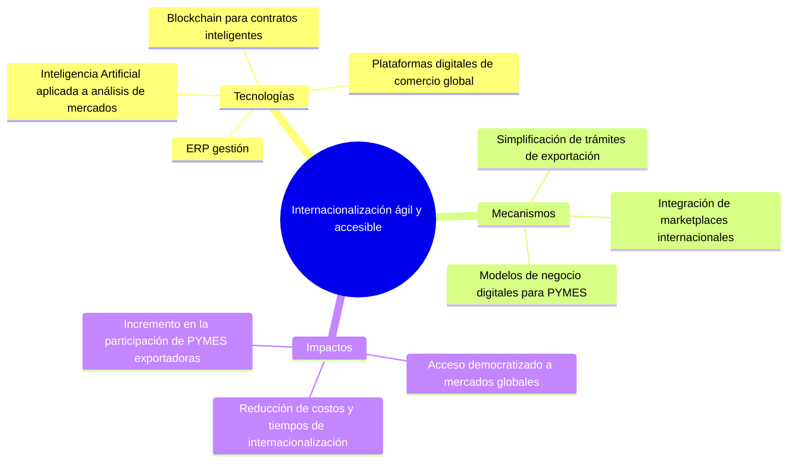
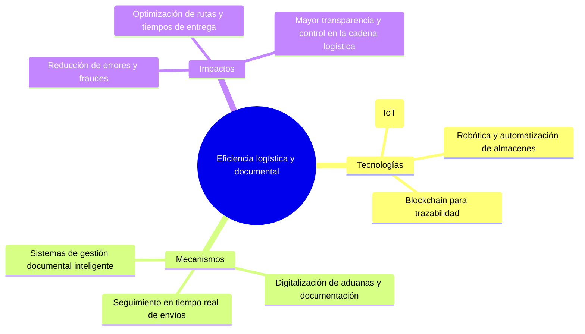
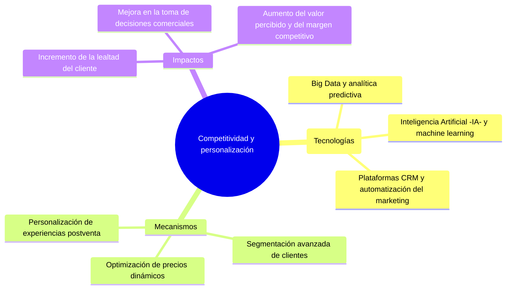

# Negocios internacionales en la era digital

La revolución digital ha redefinido la forma en que las empresas se insertan en los mercados globales. La adopción de tecnologías emergentes —como la inteligencia artificial, el Internet de las cosas, el blockchain y la automatización— ha permitido que la internacionalización sea más dinámica, eficiente y competitiva. En este contexto, los negocios internacionales ya no dependen únicamente de la presencia física o de la intermediación tradicional, sino de la capacidad para integrar datos, procesos y decisiones en tiempo real.

La transformación digital no solo acelera las operaciones, sino que también democratiza el acceso al comercio exterior, optimiza la logística y permite a las organizaciones ofrecer experiencias más personalizadas. Este documento sintetiza los tres ejes estratégicos que impulsan la evolución de los negocios internacionales en la era digital.

---

## 1. Tecnologías habilitadoras o factores clave

- **Inteligencia Artificial (IA):** automatiza análisis predictivos, mejora la toma de decisiones y permite personalización avanzada.  
- **Big Data y Analítica Avanzada:** transforma datos globales en conocimiento accionable.  
- **Blockchain:** garantiza transparencia, trazabilidad y seguridad en transacciones internacionales.  
- **Internet de las Cosas (IoT):** permite monitoreo en tiempo real de mercancías y procesos logísticos.  
- **Automatización y Robótica:** optimizan flujos de trabajo y reducen tiempos operativos.  
- **Plataformas de Comercio Electrónico Global:** facilitan la entrada de PYMES en mercados internacionales.  
- **Economía Circular y Sostenibilidad:** integran prácticas responsables en la cadena global de valor.  

---

## 2. Mapa integrado

---

## 3. La internacionalización más ágil y accesible

**Objetivo:** facilitar la expansión global de empresas de todos los tamaños mediante la digitalización de procesos, la reducción de barreras de entrada y la creación de ecosistemas conectados.

---

## 5. La eficiencia en la gestión logística y documental

**Objetivo:** optimizar la cadena de suministro y los procesos administrativos mediante tecnologías que garanticen trazabilidad, automatización y seguridad.

---

## 5. La mejora de la competitividad y personalización de servicios

**Objetivo:** potenciar la diferenciación estratégica y la fidelización de clientes mediante el uso inteligente de datos y soluciones digitales centradas en la experiencia del usuario.

---

## 6. Conclusión

La digitalización ha convertido los negocios internacionales en un ecosistema inteligente, interconectado y orientado al dato. La **internacionalización digital** facilita la entrada a nuevos mercados; la **eficiencia logística** redefine la gestión operativa; y la **personalización competitiva** fortalece la relación con el cliente.

Las organizaciones que integren estos tres ejes lograrán:

- Mayor resiliencia ante los cambios del entorno global.
- Capacidad de respuesta en tiempo real.
- Ventajas competitivas sostenibles basadas en innovación y experiencia de cliente.

El futuro de los negocios internacionales no depende solo de la expansión geográfica, sino de la **agilidad digital, la transparencia operativa y la inteligencia estratégica** con la que las empresas actúen en la economía global del siglo XXI.

---

