# Impacto Digital Proyectos

## Resumen Ejecutivo

Los proyectos ORG-DIG-02 y ORG-DIG-07 han marcado el inicio de un proceso de transformación digital en CanaryBanana Export. Aunque la empresa ha conseguido avances significativos en la organización y gestión de su información, la digitalización aún se encuentra en una fase inicial. Se han mejorado aspectos clave como la trazabilidad logística, la integración de datos entre áreas y la automatización parcial de los procesos administrativos. Sin embargo, persisten retos relacionados con la adopción del cambio, la capacitación del personal y la consolidación de una infraestructura tecnológica más madura. Este informe presenta los principales logros y dificultades observadas tras la puesta en marcha de los proyectos.

De los nuevos proyectos se han implementado un repositorio en la nube (**drive compartido**) y  se ha digitalizado la cadena logística y almacenes (**impresión de etiquetas y lectores de información desde la plantación al almacen** ).

## Desarrollo

Antes del despliegue de los proyectos de digitalización, CanaryBanana Export operaba con un nivel tecnológico muy básico.Las tareas administrativas, contables y logísticas se gestionaban de forma manual o mediante hojas de cálculo independientes. Esta fragmentación generaba duplicidades, errores en la documentación y lentitud en la coordinación entre departamentos. La falta de trazabilidad digital dificultaba la respuesta ante incidencias y limitaba la transparencia hacia los clientes internacionales.

Con los proyectos ORG-DIG-02 y ORG-DIG-07 se ha puesto en marcha una estructura inicial de gestión integrada, apoyada en modelos digitales de datos y operaciones. La implantación de un sistema de datos maestros ha permitido ordenar información básica sobre clientes, productos, puertos y plantas, creando una base común para las áreas de logística, finanzas y ventas. Este avance, aunque parcial, ha contribuido a mejorar la coherencia interna de los datos y a reducir los errores derivados de la gestión manual.

Uno de los progresos más visibles se encuentra en el control de las operaciones logísticas. La digitalización de pedidos y envíos ha introducido un sistema de seguimiento más sistemático, con estados que permiten conocer la evolución de cada envío. Aun así, la trazabilidad completa en tiempo real no se ha alcanzado, ya que la integración con los agentes externos y las navieras sigue dependiendo de intercambios manuales o de correos electrónicos. Este punto se identifica como un área prioritaria de mejora en futuras fases del proceso.

En el ámbito financiero, la automatización de las facturas y su vinculación con los pedidos ha permitido reducir parte del trabajo manual del personal administrativo. No obstante, el sistema aún requiere intervenciones frecuentes para la conciliación de pagos y la validación de datos. Los avances en este campo muestran un potencial claro, pero también evidencian la necesidad de consolidar procesos más estables y de dotar al personal de formación en el uso de las nuevas herramientas.

La migración hacia herramientas en la nube ha supuesto una mejora relevante en el acceso a la información, especialmente para el personal que trabaja entre distintas islas o en contacto con puertos internacionales. Sin embargo, la infraestructura de red y la conectividad no siempre garantizan un rendimiento óptimo. Persisten también dudas entre algunos empleados respecto a la seguridad y privacidad de los datos almacenados en entornos compartidos.

A nivel organizativo, los cambios tecnológicos han comenzado a modificar la dinámica interna. Algunos roles administrativos han evolucionado hacia funciones más analíticas, mientras que el área de IT ha adquirido mayor protagonismo como soporte a la gestión. 

No obstante, la adopción del cambio ha sido desigual: mientras parte del personal se adapta con rapidez, otros manifiestan dificultades en el manejo de las nuevas herramientas o cierta resistencia a abandonar los métodos tradicionales.

En conjunto, la digitalización ha permitido a la dirección disponer de una visión más clara de las operaciones, aunque el uso analítico de los datos sigue siendo incipiente. La empresa comienza a incorporar criterios de eficiencia y control basados en información integrada, pero aún debe avanzar hacia sistemas de análisis más automatizados y cuadros de mando operativos.

El impacto positivo de los proyectos es evidente, aunque limitado todavía por la falta de madurez tecnológica y por la necesidad de consolidar la cultura digital entre todos los equipos.

---

## Diagrama actualizado

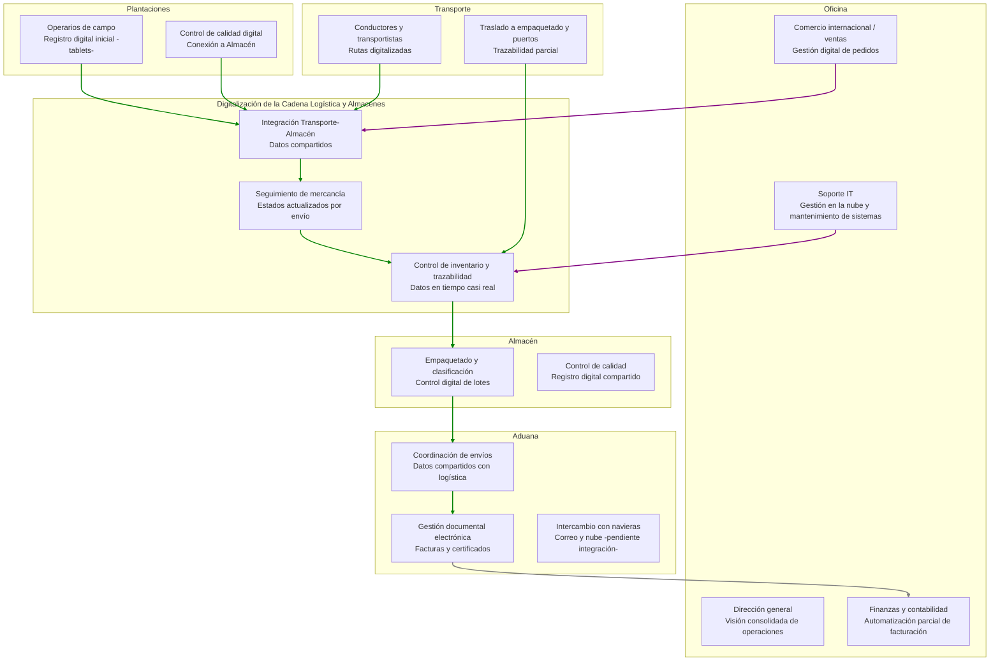

---

# Introducción a las TDH

Después de 15 años de crecimiento, CanaryBanana se ha consolidado como
una empresa agroexportadora reconocida en el mercado internacional. Su
trayectoria se ha apoyado en la calidad del producto, el esfuerzo del
personal y una logística capaz de conectar las plantaciones canarias con
los clientes europeos.

El análisis del estado actual revela que gran parte del trabajo diario
depende todavía de procesos manuales, documentos en papel, falta de
integración entre áreas y una limitada trazabilidad operativa. Estas
debilidades generan riesgos en tareas esenciales como calidad,
logística, documentación de exportación y toma de decisiones
financieras.

Sin embargo, la empresa ha dado sus primeros pasos firmes hacia la
modernización. Gracias a las mejoras asociadas a ORG-ED-02 y ORG-ED-07:

- La información de campo y almacén empieza a registrarse digitalmente.
- El flujo logístico incorpora estados y rutas más controladas.
- La documentación comienza a estandarizarse en formato electrónico.
- Los pedidos, facturación y cobros adoptan procesos digitales.
- Un repositorio en la nube mejora el acceso y la colaboración entre áreas.

Estas mejoras suponen una transición desde un entorno manual hacia una
digitalización básica conectada. Aun así, la integración completa, la
analítica avanzada y la trazabilidad total siguen siendo retos por
abordar.

> **CanaryBanana ha iniciado su transformación digital con una base
> positiva, pero aún queda un camino importante para lograr una
> integración plena e inteligente.**

Para dar continuidad a esta transformación, la dirección de CanaryBanana ha contratado a un equipo de consultores IT especializados en digitalización agroexportadora. Su misión consiste en diseñar un plan integral basado en dos pilares complementarios: la modernización tecnológica del proceso agro-bananero y la digitalización de la dimensión comercial e internacional. Este enfoque dual permitirá alinear producción, logística, calidad, exportación y análisis de datos dentro de un ecosistema digital coherente, escalable y orientado a la competitividad global.

**Negocios Internacionales Digitales: la dimensión externa**

Metas para competir y operar en mercados internacionales mediante tecnologías como IA, blockchain, IoT logístico, analítica y plataformas globales.

- Optimizar logística de exportación, documentación y trazabilidad.

- Aumentar transparencia con clientes europeos.

- Facilitar la internacionalización ágil, con menos trámites y más
información en tiempo real.
- Mejorar personalización, competitividad y acceso a mercados.

>**Visión comercial--logística--estratégica**

**Transformación Digital Agro-Bananera: la dimensión interna**

Metas en la producción agrícola y en cómo digitalizar
todo el proceso operativo:

- IoT agrícola, drones, riego inteligente, gemelo digital.

- IA para predicción de rendimientos y planificación.

- Blockchain para garantizar calidad y seguridad alimentaria.

- ERP agrícola + SCM para integrar toda la cadena productiva.

>**Es la visión operativa--productiva--técnica**

## Tecnologías Habilitadoras Digitales para Agro-Bananera

### Ámbito de producción y eficiencia operativa

- **IoT agrícola:** sensores de suelo, humedad, temperatura,
    nutrientes y radiación.
- **Teledetección y drones:** imágenes multiespectrales, NDVI,
    detección de estrés hídrico y plagas.
- **Gemelo digital:** simulación virtual de plantaciones y escenarios
    de manejo.
- **Automatización y robótica:** maquinaria inteligente para riego,
    poda y recolección.
- **Riego inteligente:** control automático con datos IoT y
    predicciones meteorológicas.
- **Automatización energética:** control del consumo e integración con
    energías renovables (fotovoltaica).

### Ámbito de gestión y análisis de datos

- **ERP agrícola:** registro centralizado de costes, lotes,
    rendimientos y operaciones.
- **Big Data agrícola:** lago de datos unificado para integrar
    información de sensores, clima y producción.
- **Inteligencia Artificial (IA):** predicción de rendimientos,
    plagas, eficiencia hídrica y logística.
- **Dashboards y BI:** visualización de indicadores clave (KPIs) de
    producción, costes, eficiencia y sostenibilidad.

### Ámbito de trazabilidad, seguridad y sostenibilidad

- **Blockchain alimentaria:** registro inmutable de la cadena productiva y logística.
- **SCM (Supply Chain Management):** coordinación de proveedores,transporte y distribución.
- **Certificación digital y ESG:** integración con normas GlobalG.A.P,
    ISO 22000, Rainforest Alliance.
- **IoT logístico:** sensores de cadena de frío, GPS, temperatura yhumedad en transporte.
- **Economía circular digital:** plataformas para reutilizar residuosagrícolas (biogás, compost).
- **Monitorización ambiental:** seguimiento automático de emisiones,agua, energía y residuos.

## Diagramas agro-bananera

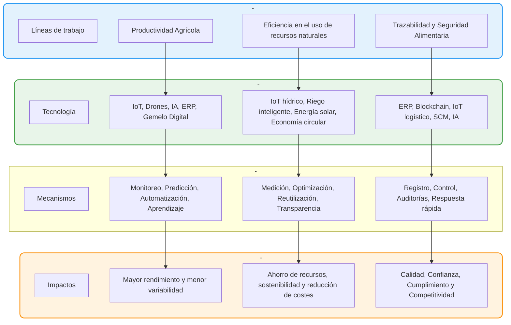

### Productividad Agrícola

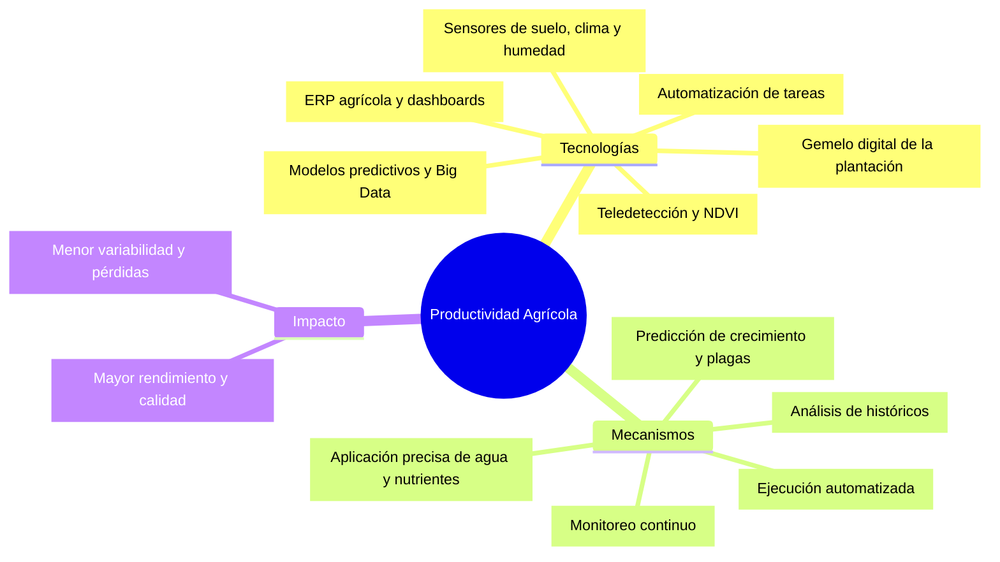

### Eficiencia en el Uso de Recursos Naturales

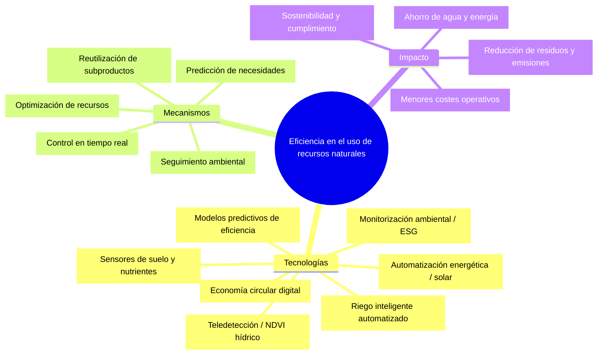

------------------------------------------------------------------------

#### Trazabilidad y Seguridad Alimentaria

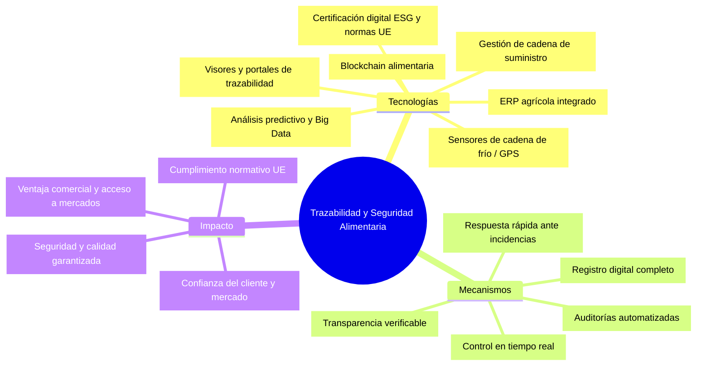

## Tecnologías Habilitadoras Digitales para Negocios internacionales

- **Inteligencia Artificial (IA):** automatiza análisis predictivos, mejora la toma de decisiones y permite personalización avanzada.
- **Big Data y Analítica Avanzada:** transforma datos globales en conocimiento accionable.
- **Blockchain:** garantiza transparencia, trazabilidad y seguridad en transacciones internacionales.
- **Internet de las Cosas (IoT):** permite monitoreo en tiempo real de mercancías y procesos logísticos.
- **Automatización y Robótica:** optimizan flujos de trabajo y reducen tiempos operativos.
- **Plataformas de Comercio Electrónico Global:** facilitan la entrada de PYMES en mercados internacionales.
- **Economía Circular y Sostenibilidad:** integran prácticas responsables en la cadena global de valor.

## Diagramas Negocios internacionales 

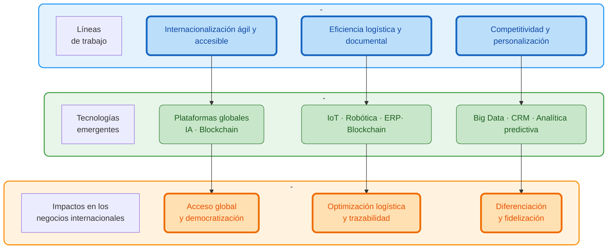

### La internacionalización más ágil y accesible

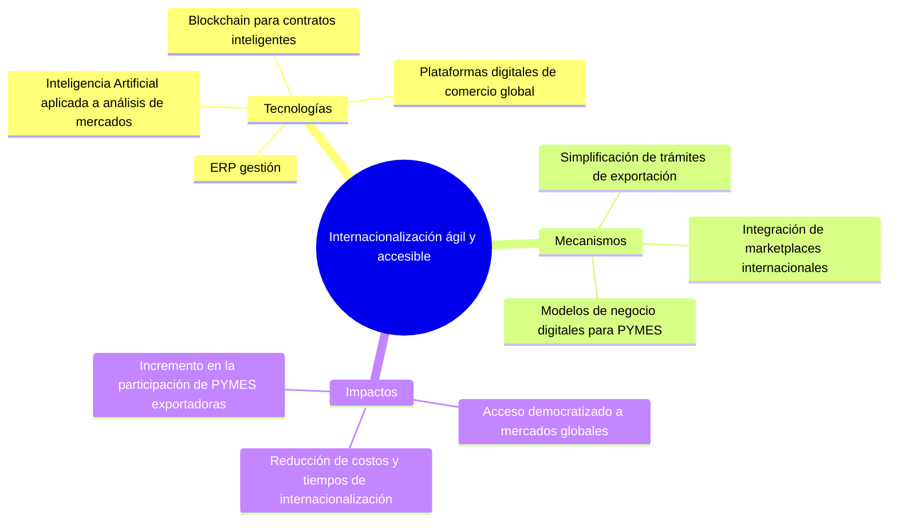

### La eficiencia en la gestión logística y documental

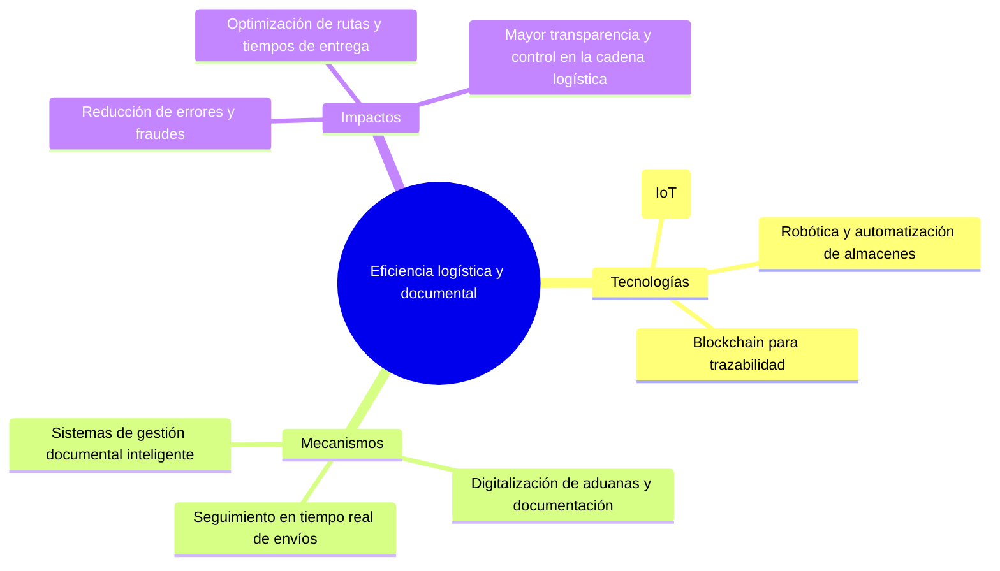

### La mejora de la competitividad y personalización de servicios

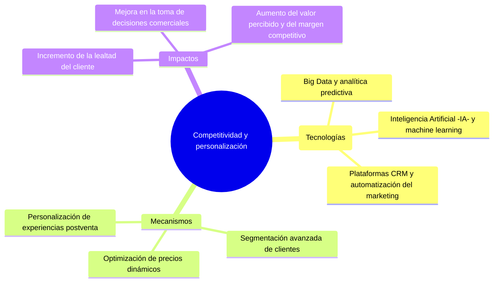

-->Re

# Fases de aplicación de TDH

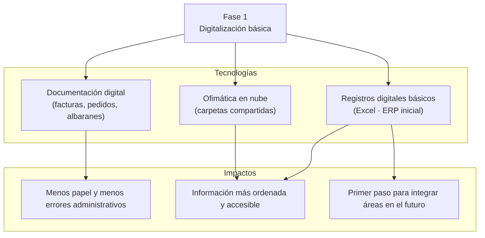

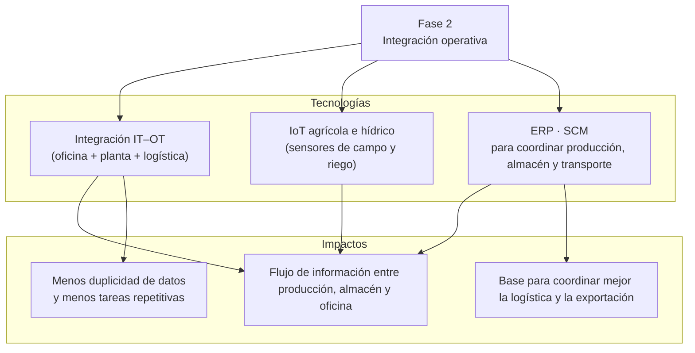

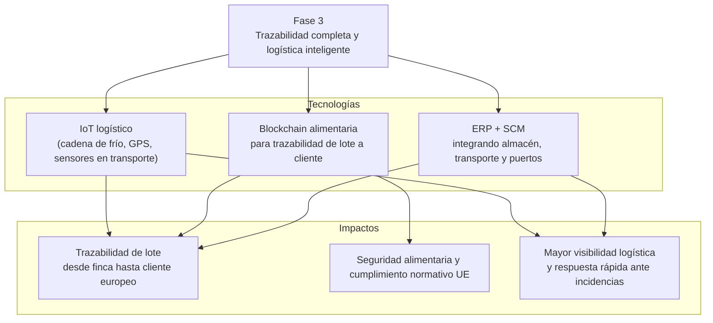

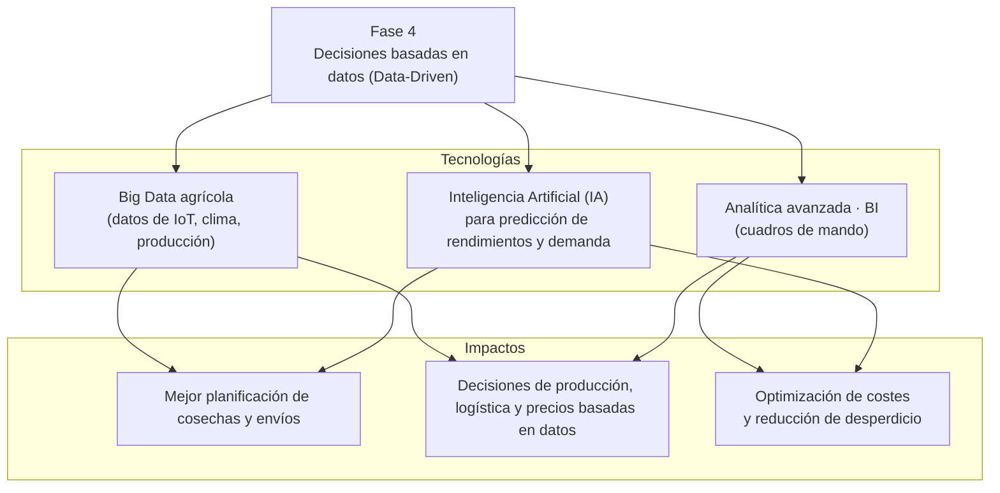

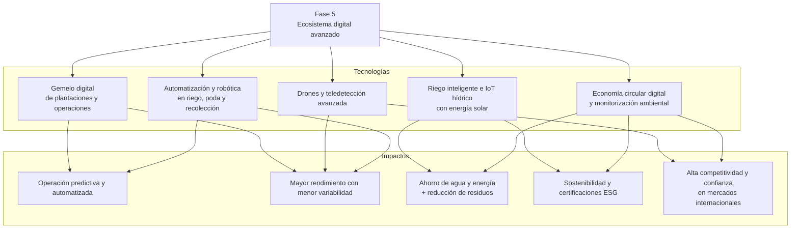