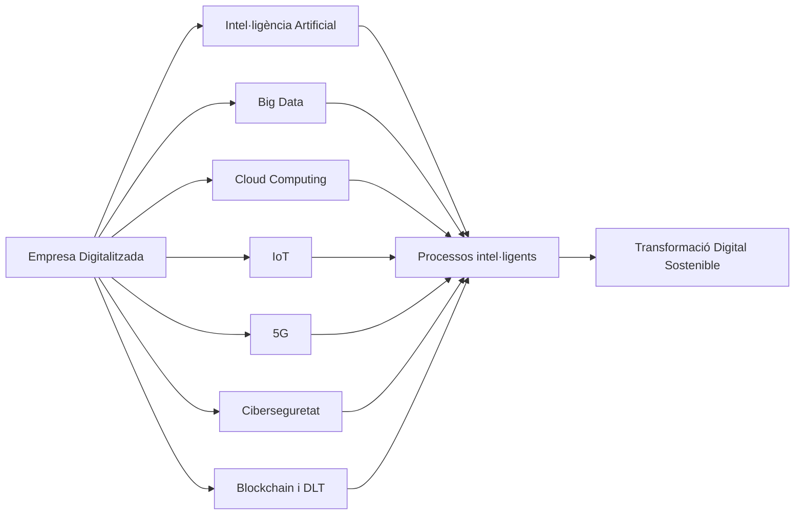
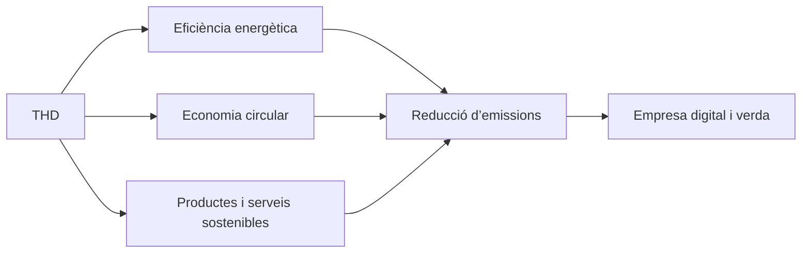
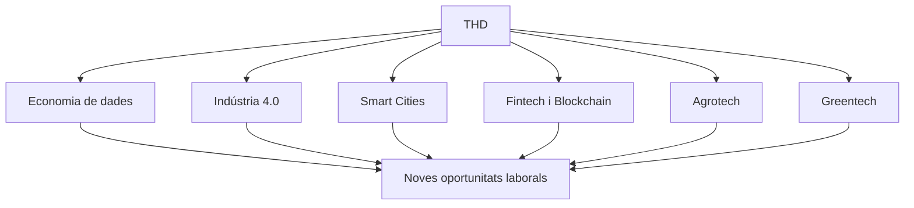

# RA2 – Tecnologies Habilitadores Digitals (THD)

## Identificació i descripció de les Tecnologies Habilitadores Digitals (THD)

Les **tecnologies habilitadores digitals (THD)** permeten transformar les empreses tradicionals en organitzacions més **intel·ligents, connectades i sostenibles**.  
Són la base de la **Indústria 4.0** i de la **digitalització dels serveis**, afavorint la competitivitat i l’adaptació a mercats globals canviants.

### Principals THD

| Tecnologia | Descripció | Aplicacions clau |
|-------------|-------------|------------------|
| **Intel·ligència Artificial (IA)** | Permet a les màquines aprendre i prendre decisions autònomes mitjançant algoritmes i dades. | Assistents virtuals, manteniment predictiu, personalització de serveis, detecció de frau. |
| **Big Data** | Gestió i anàlisi de grans volums de dades per obtenir coneixement i millorar la presa de decisions. | Segmentació de clients, anàlisi de mercat, predicció de tendències, optimització logística. |
| **Cloud Computing** | Emmagatzematge i processament de dades al núvol, permetent escalar recursos i reduir costos. | ERP i CRM al núvol, e-commerce, col·laboració remota, IA com a servei. |
| **Internet of Things (IoT)** | Connexió d’objectes físics a internet per recollir i transmetre dades en temps real. | Sensors en logística, control d’inventari, manteniment remot, agricultura de precisió. |
| **5G** | Xarxa mòbil d’alta velocitat que permet comunicacions instantànies i connexions massives de dispositius. | Vehicles autònoms, drons, fàbriques connectades, telemedicina. |
| **Ciberseguretat** | Conjunt de mesures i protocols per protegir dades i sistemes digitals. | Encriptació, control d’accessos, seguretat en el núvol i en dispositius IoT. |
| **Blockchain i DLT (Distributed Ledger Technologies)** | Tecnologies de registre distribuït que garanteixen la traçabilitat i la transparència de les transaccions. | Criptomonedes, contractes intel·ligents, logística, traçabilitat alimentària. |

---

## Relació de les THD amb el desenvolupament de productes i serveis sostenibles i eficients

Les THD impulsen **l’eficiència energètica, la reducció d’emissions i la innovació verda**, contribuint a un model econòmic més sostenible.

<table>
<tr style="vertical-align:middle;"> 
<td>
   
</td>
<td style="vertical-align:middle;">    
<h2>Economia circular</h2>

L’economia circular és un model econòmic que busca reduir el malbaratament de recursos i minimitzar l’impacte ambiental mantenint els materials i productes en ús durant el màxim temps possible.
    

    En lloc del model tradicional “produir, usar i llençar”, l’economia circular promou reutilitzar, reparar, reciclar i repensar els processos productius per aconseguir una sostenibilitat econòmica i ecològica a llarg termini.

</td></tr></table>
---
  
### Relacions clau

| Tecnologia | Contribució a la sostenibilitat i eficiència |
|-------------|----------------------------------------------|
| **IA** | Optimitza processos productius i logístics reduint consums energètics i emissions. |
| **Big Data** | Permet decisions basades en dades per gestionar millor els recursos naturals i materials. |
| **Cloud Computing** | Redueix la necessitat d’infraestructures físiques i promou l’ús compartit d’energia eficient. |
| **IoT** | Facilita el control ambiental, el reg intel·ligent i la gestió de residus. |
| **5G** | Millora la connectivitat d’eines remotes i sistemes de monitoratge amb baix consum energètic. |
| **Ciberseguretat** | Garanteix un ús responsable i protegit de les dades en entorns digitals sostenibles. |
| **Blockchain/DLT** | Permet la traçabilitat en cadenes de subministrament i certifica processos sostenibles. |

---

## Nous sectors i mercats sorgits gràcies a les THD

L’expansió de les THD ha donat lloc a **nous models econòmics i àrees de negoci**, que generen ocupació i afavoreixen la innovació.

| Nova àrea o sector | Descripció | Exemple |
|--------------------|-------------|----------|
| **Economia de dades** | Creació de valor mitjançant l’anàlisi i comercialització de dades. | Google Data Cloud, NielsenIQ. |
| **Indústria 4.0** | Integració de sistemes físics i digitals en la producció. | Fàbriques connectades, robots col·laboratius. |
| **Comerç digital intel·ligent** | Plataformes de venda online basades en IA i Big Data. | Amazon, Shopify, Zalando. |
| **Smart Cities** | Ciutats connectades amb IoT, Big Data i 5G per gestionar mobilitat i energia. | Barcelona, Amsterdam, Singapur. |
| **Fintech i Insurtech** | Serveis financers digitals amb Blockchain i IA. | Revolut, N26, Lemonade. |
| **Agrotech** | Agricultura de precisió amb sensors, dades i automatització. | John Deere, Agroptima. |
| **Greentech i Enertech** | Innovacions en energia renovable, emmagatzematge i eficiència. | Tesla Energy, Iberdrola Smart Solar. |

---

## Conclusió

Les **tecnologies habilitadores digitals** actuen com a motor del canvi econòmic, ambiental i social.  
La seva aplicació permet a les empreses **ser més eficients, transparents i sostenibles**, i alhora **obrir nous mercats i professions digitals**.

---

## Activitat de Recerca: Agrotech, comerç internacional i sostenibilitat

**Objectiu:** Comprendre com les tecnologies habilitadores estan transformant el sector primari i impulsant un model agrícola més sostenible i competitiu.

**Instruccions de recerca:**

1. **Analitza les webs** [Agrotech](https://www.isagri.es/blog/agrotech-espa%C3%B1a) i [Comerç internacional]( https://www.google.com/url?sa=t&source=web&rct=j&opi=89978449&url=https://dialnet.unirioja.es/descarga/articulo/10261683.pdf&ved=2ahUKEwiKiKr4t6-QAxXogv0HHUJbJkc4FBAWegQIFBAB&usg=AOvVaw2qqQBKdS2DJuE2erIdHlLl)

2. **Llista** quines tecnologies utilitzen (IoT, Big Data, IA, Blockchain, 5G...).  

3. **Analitza i cerca informació** sobre els següents punts per elaborar un mapa conceptual
      - La **productivitat agrícola**.
      - L’**eficiència en l’ús de recursos naturals**.  
      - La **traçabilitat i seguretat alimentària**.  
      - L’**Internacionalització més àgil i accessible**
      - L’**Eficiència en la gestió logística i documental**
      - La **Millora de la competitivitat i personalització de serveis**
