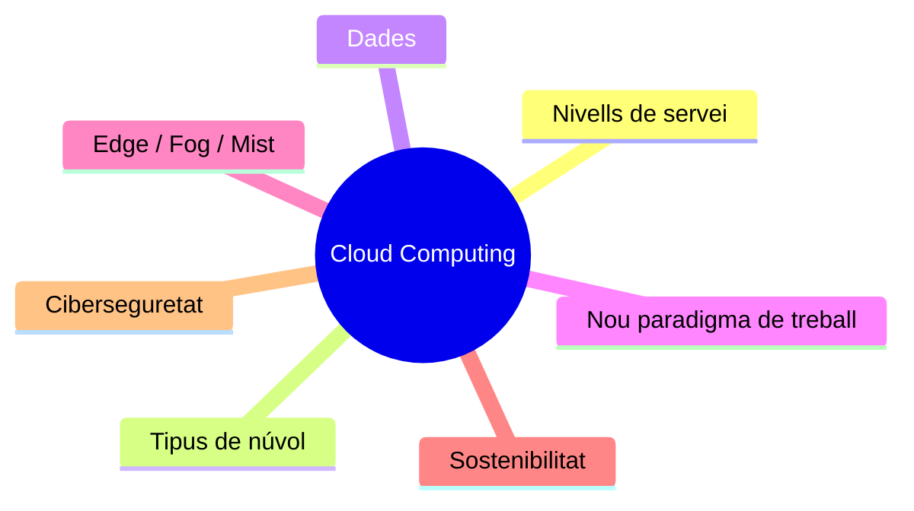
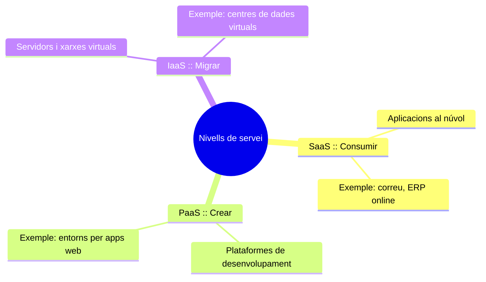
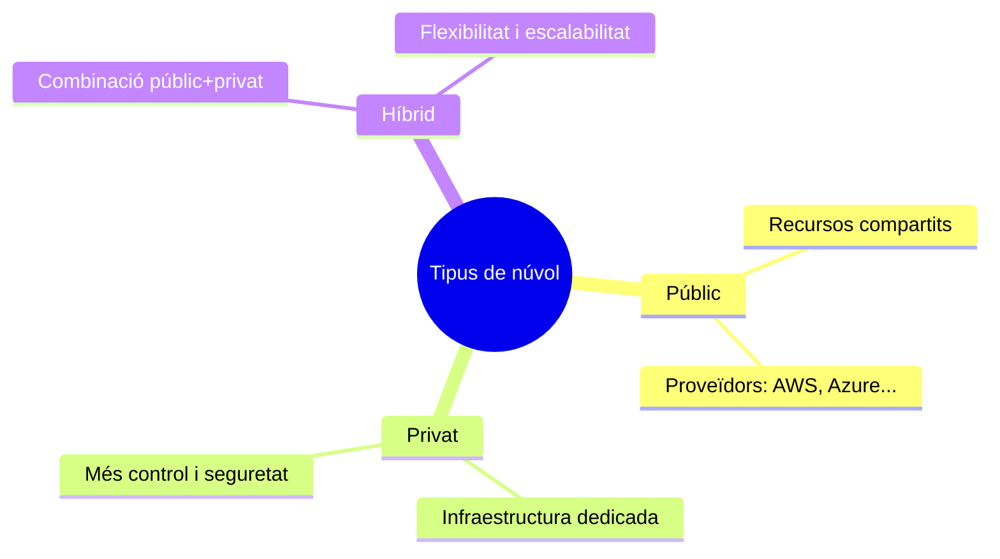
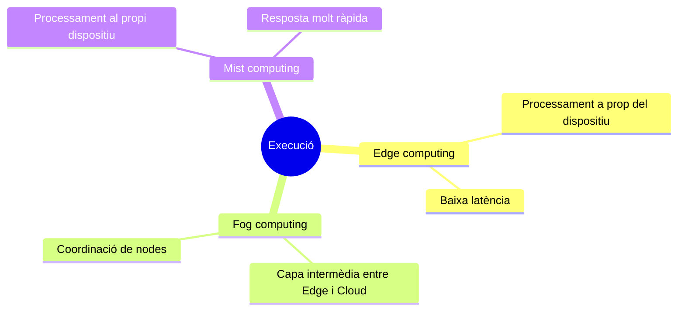
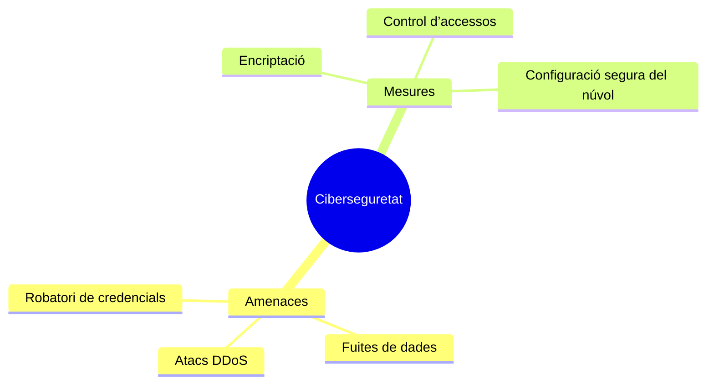
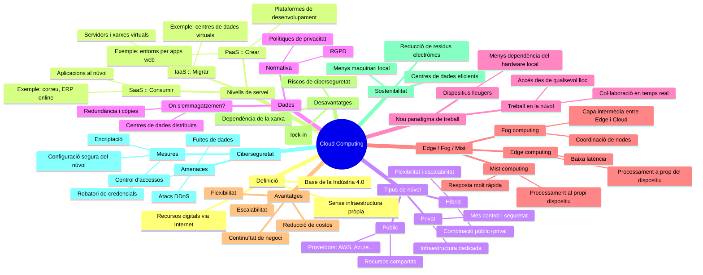

# Cloud Computing

## Introducció

El **Cloud Computing** és un model tecnològic que permet accedir a recursos digitals —emmagatzematge, servidors, aplicacions i dades— mitjançant internet, sense necessitat d’infraestructura pròpia.  
És una de les **Tecnologies Habilitadores Digitals (THD)** clau segons RA2, ja que dona suport a IA, Big Data, IoT i altres tecnologies avançades.

En el context de la Indústria 4.0, el cloud permet escalar recursos, automatitzar processos, reduir costos i adoptar nous models de treball més flexibles.

## Conceptes clau

<!--div class="table-flex"-->
  <!--div class="col-flex"-->

### Nivells del Cloud Computing

 <!--/div-->
  <!--div class="col-flex"-->

| Nivell | Significat | Funció principal |
|-|-|--|
| **SaaS (Software as a Service)** | El software es consumeix directament des del núvol. | Consumir aplicacions sense instal·lació. |
| **PaaS (Platform as a Service)** | Plataforma per crear i desplegar aplicacions. | Crear programari sense gestionar servidors. |
| **IaaS (Infrastructure as a Service)** | Infraestructura virtualitzada al núvol. | Migrar sistemes i servidors tradicionals. |

<!--/div--><!--/div-->

<!--div class="table-flex"-->
   <!--div class="col-flex"-->

### Tipus de Cloud

<!--/div-->
<!--div class="col-flex"-->

| Tipus | Definició | Ús habitual |
|-|--|--|
| **Públic** | Infraestructura compartida entre organitzacions. | Escalabilitat i baix cost. |
| **Privat** | Infraestructura dedicada a una sola empresa. | Seguretat i control elevat. |
| **Híbrid** | Combinació de núvol públic i privat. | Flexibilitat i integració. |

<!--/div-->
 <!--/div-->

---

<!--div class="table-flex"-->
  <!--div class="col-flex"-->

### On s’emmagatzemen les dades?

Les dades es troben repartides en **centres de dades distribuïts**, sovint en diferents països.

Tècniques utilitzades:

- **Replicació**
- **Redundància**
- **Còpies automatitzades**
- **Balanceig de càrrega**

La ubicació afecta al **compliment normatiu**, **seguretat** i **latència**.
 <!--/div-->
  <!--div class="col-flex"-->

--- 

### Treballar en el núvol: Nou paradigma

- Accés universal a dades i aplicacions.  
- Reducció de dependència del hardware local.  
- Treball col·laboratiu en temps real.  
- Continuïtat de negoci i resiliència.
<!--/div--><!--/div-->

---

<!--div class="table-flex"-->
  <!--div class="col-flex"-->

### Edge, Fog i Mist Computing

 <!--/div-->
  <!--div class="col-flex"-->

| Tecnologia | Definició | Objectiu |
|--|--|-|
| **Edge** | Processament a prop del dispositiu (IoT). | Reduir latència. |
| **Fog** | Intermedi entre Edge i Cloud. | Coordinació i trànsit optimitzat. |
| **Mist** | Processament mínim al dispositiu. | Resposta immediata. |
<!--/div--><!--/div-->

---

<!--div class="table-flex"-->

  <!--div class="col-flex"-->

### Avantatges i desavantatges del Cloud

| **Avantatges** | **Desavantatges** |
|----------------|-------------------|
| Escalabilitat immediata | Dependència d’internet |
| Cost variable segons consum | Vulnerabilitats de ciberseguretat |
| Flexibilitat i adaptabilitat | Dependència del proveïdor (lock-in) |
| Treball remot |  |
| Còpies i recuperació automàtica |  |
<!--/div-->
 <!--div class="col-flex"-->
---

### Cloud i sostenibilitat

- Centres de dades optimitzats energèticament  
- Menys hardware físic local  
- Reducció de residus electrònics  
- Suport a models d’economia circular 
<!--/div--><!--/div-->

---

<!--div class="table-flex"-->
  <!--div class="col-flex"-->

### Incidents de ciberseguretat en el Cloud

 <!--/div-->
  <!--div class="col-flex"-->
| **Incidents típics** | **Mesures** |
|---------------------|-------------|
| Fuita de dades | Encriptació |
| Robatori de credencials | Controls d’accés |
| Configuració incorrecta | Polítiques Zero Trust |
| Atacs DDoS | Monitoratge continu |

<!--/div--><!--/div-->

---

## Aplicacions i impacte en l'empresa

<!--div class="table-flex"-->
  <!--div class="col-flex"-->

### Eficiència i productivitat

<table>
<tr>
<td>  Automatització de processos  
<td>  Reducció de costos d’infraestructura  
<td>  Creixement escalable  

</td></tr></table>

### Col·laboració i mobilitat
<table>
<tr>
<td>Treball remot i síncron  
<td>Dades accessibles des de qualsevol lloc  

</td></tr></table>

### Indústria 4.0

<table>
<tr>
<td>Fonament per IoT, IA, Big Data  
<td>Integració amb sistemes ciberfísics  
<td>Manteniment predictiu  
</td></tr></table>

 <!--/div-->
  <!--div class="col-flex"-->

### Sostenibilitat

<table>
<tr>
<td>Optimització de recursos  
<td>Reducció d'emissions i residus  
</td></tr></table>

### Nous sectors i oportunitats

<table>
<tr>

<td>Enginyeria Cloud  
<td>DevOps  
<td>Ciberseguretat Cloud  
<td> Especialistes IoT i Edge  
<td>Sostenibilitat digital
</td></tr></table>

## Activitat final de recerca

1. Investiga 2 empreses que utilitzen CRM/ERP al núvol.  
2. Compara cloud públic, privat i híbrid.  
3. Analitza un incident real de ciberseguretat cloud.  
4. Elabora un mapa conceptual Cloud + CRM + ERP + Edge/Fog

<!--
<!--/div-->
<!--/div-->

<!--
## Relació entre Cloud i CRM/ERP

### 1. Per què CRM i ERP estan al núvol?

Els sistemes moderns funcionen com **SaaS**:
- No requereixen instal·lació  
- Accés via web  
- Actualització automàtica  
- Dades centralitzades i segures  

**Exemples**  
CRM: HubSpot, Zoho, Salesforce  
ERP: Odoo, Holded, SAP Cloud  

### 2. Relació amb la RA

| Contingut RA3 | Aplicació en CRM/ERP |
||--|
| SaaS | El model usat pels alumnes |
| Tipus de Cloud | CRM (públic), ERP (públic/híbrid) |
| Emmagatzematge | Dades de clients i inventari |
| Ciberseguretat | Protegir dades sensibles |
| Treball en el núvol | Activitats en remot |

### 3. Propostes de pràctiques

**Pràctica 1 – CRM**  
- Crear comptes  
- Afegir clients  
- Registrar activitats comercials  

**Pràctica 2 – ERP**  
- Crear productes  
- Simular comandes i factures  
- Generar informes  

**Pràctica 3 – Seguretat**  
- Analitzar permisos  
- Configurar rols  

**Pràctica 4 – Comparació**  
- ERP SaaS vs instal·lat localment  
- Components Edge/Fog en un escenari real  

## 6. Conclusió
El Cloud Computing és essencial per a la digitalització empresarial.  
Permet models flexibles, eficients, sostenibles i compatibles amb la Indústria 4.0, a més de facilitar l'ús de CRM i ERP en entorns educatius i professionals.

## 7. Activitat final de recerca

1. Investiga 2 empreses que utilitzen CRM/ERP al núvol.  
2. Compara cloud públic, privat i híbrid.  
3. Analitza un incident real de ciberseguretat cloud.  
4. Elabora un mapa conceptual Cloud + CRM + ERP + Edge/Fog.  

## indie
Cloud. Definición y niveles. Computacion en la nube

Niveles 
SAAS-Consumir
Pass-Crear
iass-Migrar

Cloud publico, privado e hibrido
Donde estan los datos guardados
Trabaja en la nuve, nuevo paradigma

Edge computing
Fog i mist
Ventajas y desventajas de trbajar en la red
Cloud y sostenibilidad
Incidentes en ciberseguridad

-->