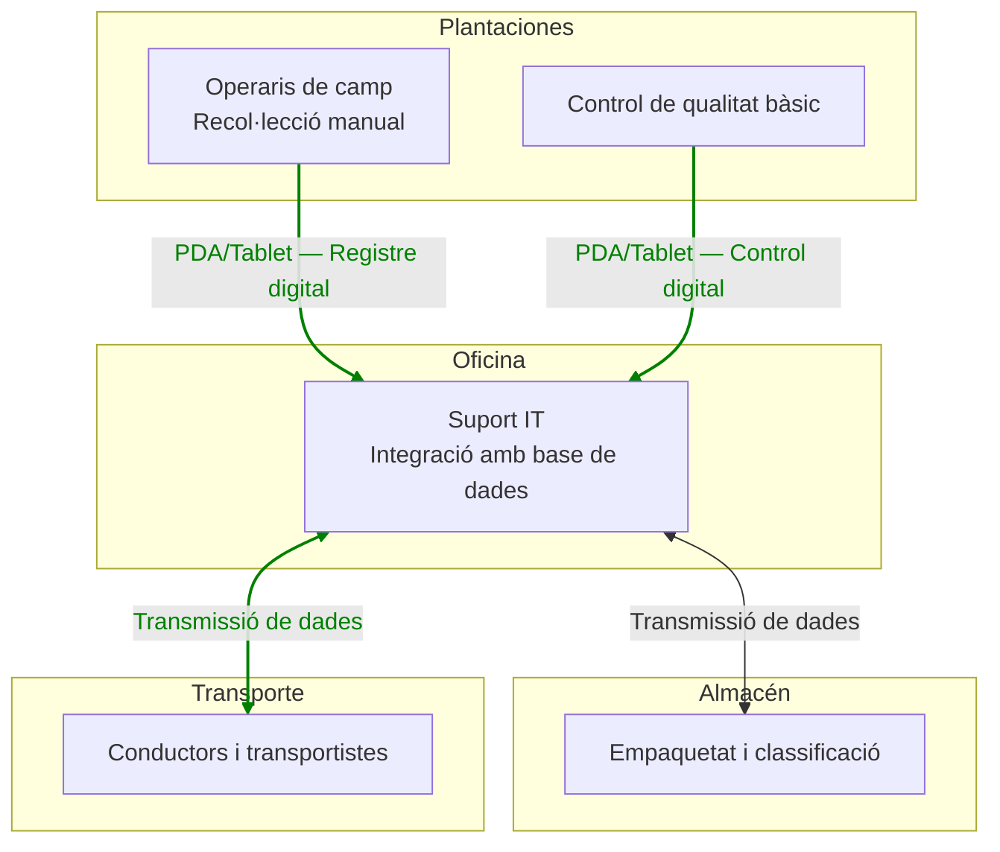

# Portafoli de Digitalització — Bloc Plantacions

## Diagrama (actualitzat)

## Portafoli — Substitució de Mòbils per PDA/Tablets

**Raons de substitució**

- Els mòbils/SMS només permeten comunicació bàsica i no garanteixen la traçabilitat digital.
- Les PDA/Tablets permeten recollida de dades en temps real, integració amb bases de dades i ús d’aplicacions sectorials.
- Millora la coordinació entre camp, transport, magatzem i oficina.

**Formació necessària**

- Operaris de camp: ****

- Responsables de qualitat: ****

- Equip IT: ****

**Costos estimats**

- Inversió inicial: ¿Quantitat?

- Software: ¿Quantitat?

- Formació: ¿Quantitat?

- Manteniment: ¿Quantitat?

**Beneficis**

- Traçabilitat completa: xxxx.
- Eficiència: yyy.
- Qualitat: zzz.
- Competitivitat: aaa.
- Estalvi: bbb.